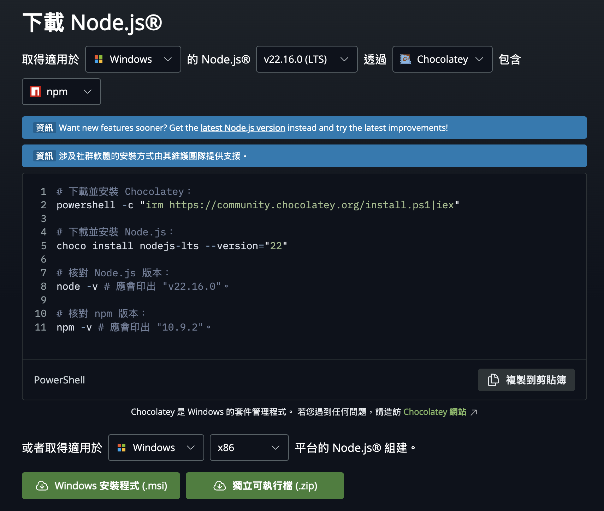

# 一、開發環境建立

---

# Node.js 安裝指南

本章節將介紹如何在不同作業系統上安裝 Node.js

<!--
我們都知道 Vue 是一個 JS 的框架

所以在我們正式開始 Vue 的介紹之前

我們需要先確認自己本機都有 Node.js

 -->

---

## macOS 安裝

 

### 安裝步驟

 

1. 前往 [Node 官網](https://nodejs.org/zh-cn/download)
2. 點擊 `macOS 安裝程序`
3. 打開安裝檔並依據安裝提示安裝
4. 打開終端工具，並輸入 `node -v` 檢查 node 是否安裝成功

 

#### 補充說明：

- 安裝包中會包含 Node、npm 主程式
- 安裝路徑皆為：`usr/local/bin`

<!--
首先先跟各位說明一下 Mac 的安裝方式

在蘋果的環境中其實有兩種安裝方式

一種是透過一個叫做 Homebrew 的套件管理工具來安裝

另一種則是透過 Node 官網來安裝

首先我們一定是需要先進到 node 的官網

點擊 macOS 安裝程式

之後等安裝的 pkg 下載完成後

依照安裝提示安裝就可以了

如果要確認自己有沒有安裝成功

可以打開終端機，輸入 node -v 看看有沒有版本號跑出來

 -->

---

## Windows 安裝

 

### 安裝步驟

 

1. 前往 [Node 官網](https://nodejs.org/zh-cn/download)
2. 點擊 `Windows 安裝程式`
3. 打開安裝檔並依據安裝提示安裝
4. 打開終端工具，並輸入 `node -v` 檢查 node 是否安裝成功

 

#### 補充說明：

- 安裝包中會包含 Node、npm 主程式
- 安裝路徑皆為：`C:\Program Files\nodejs\`

<!--
接著是 Windows 的安裝方式

基本上跟 Mac 的安裝步驟是一樣的

唯一不同的是 Windows 的安裝步驟是透過一個叫做 Chocolatey 的套件管理工具來安裝

-->
