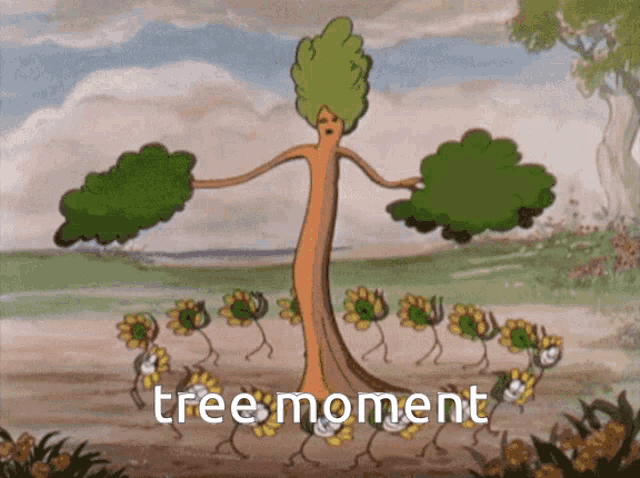

# <div text-5xl font-bold mb-8>三、先行重點名詞解釋</div>

<div text-xl text-gray-300 pt-2 v-click mb-2>什麼是 DOM ( Document Object Model ) ？</div>
<div text-xl text-gray-300 pt-2 v-click>什麼是 Virtual DOM ( Virtual Document Object Model ) ?</div>

<!--
在進入 Vue 介紹之前

[click] 先來介紹一下什麼是 DOM

[click] 什麼是 Virtual DOM
-->

---

# <span class="font-bold tracking-wide">什麼是 DOM ？</span>

<div class="-translate-x-2 text-center text-xl op75 mb-4"> ( Document Object Model )</div>

<div class="-translate-x-2 text-center text-xl font-bold w-max bg-zinc-500/50 rounded-lg px-4 py-1.5 mx-auto" v-click>文件物件模型</div>

<!--
什麼是 DOM呢 ?

[click] DOM 全名是 Document Object Model，中文叫做 "文件物件模型"
-->

---

<h1 text-center font-bold>DOM & HTML 文件</h1>

<div class="grid grid-cols-2 gap-x-4 h-80 mt-8">

<div
  transition duration-500
  :class="$clicks < 1 ? 'translate-x-55' : ''"
>

```html {*|*|*|3-10|11-16}{at:2}
<!DOCTYPE html>
<html lang="en">
<head>
  <meta charset="UTF-8">
  <meta
    name="viewport"
    content="width=device-width, initial-scale=1.0"
  >
  <title>我的網頁</title>
</head>
<body>
  <div>
    <h1>標題</h1>
    <p>段落內容</p>
  </div>
</body>
</html>
```

</div>

<div forward:delay-500 v-click>

```markdown {*|*|1|3-4|5-8}{at:2}
- document ( 根節點 )
    - html
        - head
            - title ( 包含文字節點 "我的網頁" )
        - body
            - div
                - h1 ( 包含文字節點 "標題" )
                - p ( 包含文字節點 "段落內容" )
```

</div>

</div>

<div class="absolute right-24 bottom-12 w-52" v-click>
  
</div>

<!--
DOM 聽起來很抽象，也確實他很抽象

把靜態的 HTML 文件中所有標籤、文字、圖片 ...等等，轉換成樹狀結構的程式介面，

這個樹狀結構是可以透過 JavaScript 去動態操作的物件，就稱為 DOM，

[click] 實際上 DOM 樹狀結構可以長得像右邊這樣 👉

[click] 由上面每一個「節點 ( node )」組成的一個樹狀結構，每個節點都可以是一個元素或文字。

[click] 像 `document` 就是整個文件節點

[click] `head` 包含了 meta 資訊和標題 `title`

[click] `body` 裡面有 `div`、`h1`、`p` 等網頁元素
-->
