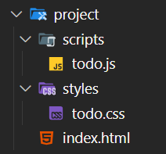

<div class="mb-8">

# <span text-5xl font-bold tracking-wide>四、漸進式 JavaScript 框架 - Vue</span>

</div>

<div v-click>
  
</div>

<!--
接下來進入正題，

[click] 來介紹 Vue 這個漸進式框架。 ( 顯示 Vue logo )
-->

---
layout: center
transition: slide-left
---

<!-- 1. 何謂「漸進式」框架 ? -->

# <span class="font-bold tracking-wide">何謂<span v-mark.teal.highlight.delay400.op30>「漸進式」</span>框架 ?</span>

<!--
[click] 什麼是「漸進式」框架呢 ? →
-->

---
layout: center
transition: slide-left
---

<div class="flex flex-col items-center gap-y-8 mb-8">

<div class="w-80 h-80">
  
</div>

<div class="text-2xl tracking-wide" v-click>讓開發者能根據實際需求，逐步、漸進地採用框架的功能</div>

</div>

<!--
[click] 它的設計理念是讓開發者能根據實際需求，逐步、漸進地採用框架的功能。

就像在爬樓梯，如果在爬了十層後就可以完成需求，那你只需要爬到第十層就好了。
如果新增了需求需要爬到二十層，那你可以基於第十層再往上爬十層到第二十層完成需求。
-->

---
layout: center
transition: slide-left
---

## <div class="font-bold tracking-wider text-center">框架的存在是為了<span v-mark.green.highlight.op30.delay400>方便開發者做事</span></div>

<div class="mt-8" v-click>

<div v-mark.linethrough.red.op80="{at:3,roughness:6}">

`watchEffect()`、`toRef()`、`effectScope()`、`onUpdated()`、`useSlots()` ...

</div>

</div>

<!--
[click] 框架的存在是為了方便開發者做事，開發者只需要根據自己的需求選擇所需要用到的工具就可以了，

[click] 不一定會需要用到工具箱中每項工具，像這些是 Vue 提供的其中一些 API 方法，

[click] 但在專案中可能沒有機會使用到。
-->

---
layout: center
transition: slide-left
---

<!-- 2. Vue 的模板語法 -->
<div
  transition duration-300
  :class="$clicks > 1 ? '-translate-y-8' : ''"
>

# <div class="font-bold tracking-wide text-center">Vue 的模板語法</div>

<div class="text-xl font-bold text-center" v-click>
  <code>&lt;template&gt; ... &lt;/template&gt;</code>
</div>

</div>

<div class="flex items-center justify-center gap-x-8 mt-8 text-xl">

<div v-click>✅ 類似 HTML 的模板</div>
<div v-click>❌ 純正的 HTML</div>

</div>

<!--
Vue 使用基於 HTML 的模板語法。

什麼是模板語法呢 ?

[click] 模板的標籤是 `<template>`，Vue 的底層機制會將這個 `<template>` 模板裡面所有元素編譯成高度優化後的 JavaScript 程式碼，在資料狀態變動的時候，Vue 會細粒度的找到需要重新渲染的元素或元件，使用最少的 DOM 操作過程完成畫面更新。

[click] 所以在撰寫 Vue 元件的 `<template>` 內容時，正確來說寫的是「類似 HTML 的模板」

[click] 而不是純正的 HTML。
-->

---
layout: center
transition: slide-left
---

# <div font-bold tracking-wide text-center>單一檔案元件</div>

<div class="text-center text-xl op75" v-click>( SFC，Single-File Component )</div>

<!--
接下來要提到在 Vue 中很重要的概念 — 單一檔案元件

[click] 什麼是「單一檔案元件 Single-File Component」 ? 通常縮寫為 SFC
-->

---
layout: center
transition: slide-left
---

<div class="h-100">

<h2 class="font-bold mb-16">傳統網頁專案管理</h2>

<div class="flex gap-x-8">
  <div>
    
  </div>
<div>

<div class="flex items-center justify-start gap-x-2 mb-4 text-2xl font-bold" v-click>
  <span class="i-heroicons:exclamation-circle-16-solid text-yellow text-2xl -translate-y-0.5">exclamation</span>
  <span>開發時會遇到的問題 :</span>
</div>

<ol class="text-xl space-y-4">
  <li v-click>當一個元件需要修改時，常常需要同時改動多個檔案</li>
  <li v-click>檔案之間的依賴關係不夠直觀</li>
  <li v-click>難以確保樣式不會互相影響</li>
  <li v-click>程式碼的重用和維護較為困難</li>
</ol>

</div>
</div>
</div>

<div class="absolute right-16 bottom-20 w-56" v-click>
  
</div>

<!--
在說明單一檔案元件之前，先來看一下傳統網頁的專案管理可能會像這樣，將 HTML、CSS、JavaScript 分開在不同的檔案中管理。

[click] 這種分散的檔案管理在開發時會遇到幾個問題 :

[click] 1. 當一個元件功能需要修改時，常常會需要同時改動多個檔案。

[click] 2. 檔案之間的依賴關係不夠直觀。

[click] 3. 除非有設計良好的樣式模組管理，不然很難確保樣式之間不會互相影響。

[click] 4. 程式碼的重用和維護會比較困難。

[click] ( Gif ) 這些問題催生了許多前端框架的誕生，像是 Vue、React、Angular 等等。
-->

---
layout: center
transition: slide-left
---

<!-- 3. 單一檔案元件 ( SFC，Single-File Component ) -->
<div
  transition duration-300
  :class="$clicks > 1 ? '-translate-y-8' : 'translate-y-12'"
>
  <div class="mb-4">
    
  </div>
  <h2 class="font-bold tracking-wide text-center">單一檔案元件</h2>
  <div class="relative text-center" v-click>
    <span>( SFC，Single-File Component )</span>
    <span class="absolute right-14 inline-block px-2 py-0.5 rounded-lg text-sm bg-green font-mono text-black font-bold">*.vue</span>
  </div>
</div>

<div class="grid grid-cols-3 gap-x-12">
  <!-- HTML -->
  <div v-click>
    <div class="bg-[#f16529]/50 border-2 border-[#f16529]/30 px-6 py-2 rounded-lg shadow-xl text-center font-bold">
      HTML
    </div>
    <div class="flex flex-col items-center gap-y-2 mt-4">
      <span class="i-heroicons:arrow-down-16-solid text-xl font-bold">arrow-down</span>
      <code>&lt;template&gt;</code>
    </div>
  </div>
  <!-- CSS -->
  <div v-click>
    <div class="bg-[#33a9dc]/50 border-2 border-[#33a9dc]/30 px-6 py-2 rounded-lg shadow-xl text-center font-bold">
      CSS
    </div>
    <div class="flex flex-col items-center gap-y-2 mt-4">
      <span class="i-heroicons:arrow-down-16-solid text-xl font-bold">arrow-down</span>
      <code>&lt;style&gt;</code>
    </div>
  </div>
  <!-- JavaScript -->
  <div v-click>
    <div class="bg-[#f0db4f]/50 border-2 border-[#f0db4f]/30 px-6 py-2 rounded-lg shadow-xl text-center font-bold">
      JavaScript
    </div>
    <div class="flex flex-col items-center gap-y-2 mt-4">
      <span class="i-heroicons:arrow-down-16-solid text-xl font-bold">arrow-down</span>
      <code>&lt;script&gt;</code>
    </div>
  </div>
</div>

<div class="text-2xl text-center w-max font-bold mx-auto px-4 py-2 mt-6" v-click v-mark.green.highlight.op30="5">
  關注點分離
</div>

<!--
在 Vue 框架中，我們常常說的 Vue 元件

[click] 就是剛剛提到的 SFC，為了解決傳統網頁開發的痛點，在一個副檔名為 `.vue` 的檔案裡包含了單一個「元件」的

[click] HTML 模板，在元件中就是 `<template>` 標籤。

[click] 還有 CSS 樣式，在元件中就是 `<style>` 標籤。

[click] 還有 JavaScript 程式邏輯，在元件中就是 `<script>` 標籤。

在同一個元件中這樣拆分的目的可以幫助開發過程中，

[click] 實現元件功能上的「關注點分離」。
-->

---
layout: center
transition: slide-left
---

<h2 class="font-bold text-center mb-8">Todo.vue</h2>

<div class="w-100">

```vue {*|1-5|7-10|12-17|*}{lines:true}
<!-- JavaScript 邏輯 -->
<script setup>
import { ref } from "vue";
// ...
</script>

<!-- HTML 模板 -->
<template>
  <div>...</div>
</template>

<!-- CSS 樣式 -->
<style scoped>
.todo-list {
  ...
}
</style>
```

</div>

<!--
假設有一個元件叫做 `Todo.vue`，這個元件架構包含了 ...

[click] 元件的 JavaScript 邏輯

[click] 元件的 HTML 模板結構

[click] 元件的 CSS 樣式

[click] 這種組織方式讓元件的所有和 Todo 相關程式碼都集中在一起，除了提高了程式碼的可維護性外，在開啟編輯這個 Vue 元件的同時，也會知道正在改動有關 Todo 的畫面和功能，不需要擔心會不會影響到其他不屬於 Todo 的畫面功能。
-->

---
layout: center
transition: slide-left
---

<!-- 4. 元件的命名、基礎使用方式 -->

# <div font-bold tracking-wide text-center>元件的命名、基礎使用方式</div>

<!--
剛剛有提到 Vue 元件 ( SFC ) 包含了自己的 HTML 結構、CSS 樣式、JavaScript 邏輯。
而元件就像可以重複使用的積木，想像一下如果在網頁上很多地方都會用到"差不多樣式"的「按鈕」，不如做成一個 `MyButton.vue` 元件在需要的地方引入使用。

不過要怎麼創建元件呢 ?
-->

---
layout: center
transition: slide-left
---

<div
  transition duration-300
  :class="$clicks > 3 ? 'translate-y-0' : 'translate-y-10'"
>

<h2 class="font-bold tracking-wide text-center">Vue 元件檔案命名方式</h2>

<div class="grid grid-cols-3 gap-x-4 mt-8">
  <div class="bg-green/20 border-2 border-green/40 rounded-lg pb-6 pt-4 px-3" v-click>
    <div class="flex flex-col justify-center items-center gap-2 mb-3">
      <div i-carbon:thumbs-up-filled text-green text-2xl />
      <span class="font-bold text-lg">大駝峰 PascalCase ( 最常見 )</span>
    </div>
    <div class="font-mono text-sm space-y-1 ml-6">
      <div>MyButton.vue</div>
      <div>UserProfile.vue</div>
      <div>ProductCard.vue</div>
    </div>
  </div>
  <div class="bg-green/20 border-2 border-green/40 rounded-lg pb-6 pt-4 px-3" v-click>
    <div class="flex flex-col justify-center items-center gap-2 mb-3">
      <div i-carbon:thumbs-up-filled text-green text-2xl />
      <span class="font-bold text-lg">烤肉串 kebab-case</span>
    </div>
    <div class="font-mono text-sm space-y-1 ml-6">
      <div>my-button.vue</div>
      <div>user-profile.vue</div>
      <div>product-card.vue</div>
    </div>
  </div>
  <div class="bg-red/20 border-2 border-red/40 rounded-lg pb-6 pt-4 px-3" v-click>
    <div class="flex flex-col justify-center items-center gap-2 mb-3">
      <!-- <span class="text-red text-xl">❌</span> -->
      <div i-carbon:thumbs-down-filled text-red text-2xl />
      <span class="font-bold text-lg">避免的命名方式</span>
    </div>
    <div class="font-mono text-sm space-y-1 ml-6 opacity-70">
      <div>mybutton.vue <span class="text-xs">(全小寫)</span></div>
      <div>MYBUTTON.vue <span class="text-xs">(全大寫)</span></div>
      <div>userProfile.vue <span class="text-xs">(小駝峰)</span></div>
      <div>user_profile.vue <span class="text-xs">(底線)</span></div>
      <div>up.vue <span class="text-xs">(縮寫)</span></div>
    </div>
  </div>
</div>

</div>

<div class="mt-8" v-click>

同性質目錄例如 `components/`、`view/`、`layout/`，元件命名應該盡量統一。

</div>

<!--
先來看一下在 Vue 中元件檔案應該如何命名。

[click] 第一種大駝峰 ( PascalCase ) 是最常見也是官方建議的命名方式。

[click] 或是可以使用烤肉串 ( kebab-case ) 的命名方式也是可以的。

[click] 但像是全小寫、全大寫、小駝峰、底線命名、縮寫等等，這些命名方式應該避免使用。

[click] 在同一個專案中，Vue 元件的命名方式應該盡量統一，或者至少在同性質分類目錄下統一命名方式 ( 例如 `components/`、`view/`、`layout/` 等目錄下的 Vue 元件 )。
-->

---
transition: slide-left
---

<h2 class="font-bold fixed left-12 top-12">如何使用 Vue 元件 ?</h2>

<div class="fixed left-14 top-28 w-[28rem]" v-click>

<h3 class="text-center mb-4 text-left">父元件 - <span class="font-mono text-green">App.vue</span></h3>

````md magic-move {at:3,lines:true}
```vue {*}
<!-- App.vue -->
<script setup>
// ...
</script>

<template>
  <div>
    <h2 class="title">這個是父元件</h2>
  </div>
</template>

<style scoped>
.title {
  color: crimson;
  font-size: 2rem;
}
</style>
```

```vue {*|3,6,9-11,13}{lines:true}
<!-- App.vue -->
<script setup>
import HelloWorld from './HelloWorld.vue'
</script>

<template>
  <div>
    <h2 class="title">這個是父元件</h2>
    <HelloWorld /> <!-- PascalCase (大駝峰) -->
    <!-- or -->
    <hello-world /> <!-- kebab-case (烤肉串) -->
  </div>
</template>

<style scoped>
.title {
  color: crimson;
  font-size: 2rem;
}
</style>
```
````

</div>

<div class="fixed right-12 top-28 w-[24rem]" v-click>

<h3 class="text-center mb-4 text-left">子元件 - <span class="font-mono text-green">HelloWorld.vue</span></h3>

```vue {*}
<!-- HelloWorld.vue -->
<template>
  <div>
    <p class="msg">這個是子元件 !</p>
  </div>
</template>

<style scoped>
.msg {
  color: dodgerblue;
  font-weight: 700;
}
</style>
```

</div>

<!--
說明完元件怎麼命名，那要怎麼使用 Vue 元件呢 ?

[click] 假設我們有一個父元件 App.vue

[click] 和一個子元件 HelloWorld.vue

[click] 我們可以在父元件的 `<script>` 中使用 `import` 引入創建好的 Vue 元件，也就是子元件 `HelloWorld.vue`。

[click] 接著在模板 `<template>` 中合適的位置寫上元件標籤，這裡可以注意到，就算元件檔案用大駝峰命名，在模板中也可以使用烤肉串的方式使用 Vue 元件，Vue 會自動解析不會讓它壞掉。

不過還是建議在所有的元件中使用統一的命名方式。
-->

---
layout: center
transition: slide-left
---

<h2 class="font-bold tracking-wide text-center mb-12">回顧 Vue 元件使用步驟</h2>

<div class="flex justify-center items-center gap-8 translate-x-4">
  
  <div>
    <div class="flex flex-col items-center" v-click>
      <div class="w-16 h-16 bg-green rounded-full flex items-center justify-center text-white font-bold text-2xl mb-4">
        1
      </div>
      <div class="text-center">
        <h3 class="font-bold text-lg mb-2">建立元件</h3>
        <div v-mark.green.delay400.op80="1">
          <span class="font-mono">*.vue</span>
          <span>&nbsp;檔案</span>
        </div>
      </div>
    </div>
  </div>

  <div class="flex items-center gap-x-8" v-click>
    <div class="text-4xl opacity-50">
      →
    </div>
    <div class="flex flex-col items-center">
      <div class="w-16 h-16 bg-yellow rounded-full flex items-center justify-center text-white font-bold text-2xl mb-4">
        2
      </div>
      <div class="text-center">
        <h3 class="font-bold text-lg mb-2">引入元件</h3>
        <div v-mark.yellow.delay400.op80="2">
          <span>使用&nbsp;</span>
          <span class="font-mono">import</span>
        </div>
      </div>
    </div>
  </div>

  <div class="flex items-center gap-x-8" v-click>
    <div class="text-4xl opacity-50">
      →
    </div>
    <div class="flex flex-col items-center">
      <div class="w-16 h-16 bg-blue rounded-full flex items-center justify-center text-white font-bold text-2xl mb-4">
        3
      </div>
      <div class="text-center">
        <h3 class="font-bold text-lg mb-2">在模板使用元件</h3>
        <div v-mark.blue.delay400.op80="3">
          <span class="font-mono">&lt;template&gt;</span>
        </div>
      </div>
    </div>
  </div>

</div>

<!--
回顧一下 Vue 元件的使用步驟 :

[click] 第一步，先使用大駝峰或烤肉串命名建立 `.vue` 元件檔案。

[click] 接著在需要的地方使用 `import` 引入元件。

[click] 元件引入後就可以在模板 `template` 標籤中使用元件標籤了。
-->

---
layout: center
transition: slide-left
---

<!-- 5. 組合式 API ( Composition API ) 撰寫風格 -->
# <div class="font-bold tracking-wide text-center">組合式 API 撰寫風格</div>

<h3 class="text-center op75 tracking-wide">( Composition API )</h3>

<!--
認識 Vue 元件後，這個章節來介紹一下目前主流的 Vue 撰寫風格 — Composition API。
-->

---
layout: center
transition: slide-left
---

<h2 class="fixed left-1/2 -translate-x-1/2 top-16 font-bold tracking-wide mb-12 text-center">Vue 3 的兩種邏輯撰寫方式</h2>

<div transition duration-300 class="fixed left-32 top-36 w-80" :class="$clicks > 3 ? 'op0' : 'op100'" v-click>

<h3 class="tracking-wide mb-4 text-center">Options API</h3>

```vue {*}{lines:true}
<script>
export default {
  components: {},
  props: {},
  emits: [],
  data() {},
  computed: {},
  created() {},
  mounted() {},
  watch: {},
  methods: {},
  // ...
}
</script>
```

</div>

<div transition duration-500 origin-top-left class="fixed right-16 top-36 w-100" :class="$clicks > 3 ? 'right-1/2 -translate-x-[calc(50%+1rem)]' : ''" v-click>

<h3 class="tracking-wide mb-4 text-center">Composition API</h3>

````md magic-move {at:3,lines:true}
```vue {*|1,14|*}
<script setup>
import { ref, computed, watch } from 'vue'

defineProps({})
defineEmits([])

const data = ref()

const computedValue = computed(() => { ... })

watch(data, (newValue) => { ... })

onMounted(() => { ... })
</script>
```

```vue {*}
<script setup>
// 組合式 API
</script>
```
````

</div>

<!--
Vue 3 提供了兩種元件邏輯撰寫方式，分別是 ...

[click] Options API，選項式 API，這是一個類似物件導向的語法結構

[click] 還有 Composition API，組合式 API，也就是目前主流的函式組合寫法

[click] 可以注意的是，在 `<script>` 標籤上加上 setup 語法糖是 組合式 API ( Composition API ) 的關鍵。

[click] 由於這是目前撰寫 Vue 元件的主流方式

[click] 後續都會以 組合式 API 進行介紹。
-->

---
layout: center
transition: slide-left
---

<h2 class="relative font-bold tracking-wide text-center mb-8 w-max mx-auto">組合式 API ( Composition API ) 
  <span class="absolute -right-4 translate-x-full bg-yellow/30 px-2 py-1 rounded font-mono text-sm ml-2">&lt;script setup&gt;</span>
</h2>

<div class="grid grid-cols-1 gap-y-4 mt-8">

<div class="bg-green/10 border-2 border-green/30 rounded-lg py-4 px-6" v-click>
  <div class="flex items-center gap-3 mb-3">
    <span class="w-8 h-8 bg-green rounded-full flex items-center justify-center text-white font-bold">1</span>
    <h3 class="font-bold text-lg">響應式 API</h3>
  </div>
  <div class="font-mono text-sm bg-white/20 px-4 py-2 rounded">
    <code>ref()</code>、<code>reactive()</code>、<code>computed()</code>、<code>watch()</code>、<code>watchEffect()</code> ...
  </div>
</div>

<div class="bg-blue/10 border-2 border-blue/30 rounded-lg py-4 px-6" v-click>
  <div class="flex items-center gap-3 mb-3">
    <span class="w-8 h-8 bg-blue rounded-full flex items-center justify-center text-white font-bold">2</span>
    <h3 class="font-bold text-lg">生命週期 hooks</h3>
  </div>
  <div class="font-mono text-sm bg-white/20 px-4 py-2 rounded">
    <code>onMounted</code>、<code>onUnmounted</code> ...
  </div>
</div>

<div class="bg-purple/10 border-2 border-purple/30 rounded-lg py-4 px-6" v-click>
  <div class="flex items-center gap-3 mb-3">
    <span class="w-8 h-8 bg-purple rounded-full flex items-center justify-center text-white font-bold">3</span>
    <h3 class="font-bold text-lg">依賴注入</h3>
  </div>
  <div class="font-mono text-sm bg-white/20 px-4 py-2 rounded">
    <code>provide</code>、<code>inject</code>
  </div>
</div>

</div>

<!--
所謂 **組合式 API (Composition API)** 是在 `<script setup>` 標籤中可以使用 Vue API 的集合，例如 :

[click] 響應式 API，`ref`、`computed`、`watch` 等等

[click] 生命週期 hooks，`onMounted`、`onUnmounted` 等等

[click] 依賴注入方法，`provide`、`inject`

這些都是 Vue 內建提供的 API 方法。
-->

---
layout: default
transition: slide-left
---

<div>

<h2 class="mb-4 font-bold w-40%">Options API <span class="text-yellow">vs.</span> Composition API</h2>

<div transition-all duration-500 class="rounded-xl overflow-hidden" :class="$clicks < 1 ? 'w-110' : 'w-90'">
  
</div>

</div>

<div transition-all duration-500 class="absolute flex flex-col origin-top-right right-0 top-0 bottom-0 overflow-y-auto" :class="$clicks >= 1 ? 'op100 translate-x-0' : 'op0 translate-x-50'">

```vue {*|*|4-12|13-23|25-29|*}{lines:true}
<script setup>
import { ref, computed, onMounted } from 'vue'

// 用戶相關邏輯組合在一起
const userInfo = ref({})
const userDisplayName = computed(() => {
  return userInfo.value.firstName + ' ' + userInfo.value.lastName
})
const fetchUserInfo = async () => {
  // 獲取用戶資料邏輯 ...
}

// 產品相關邏輯組合在一起
const products = ref([])
const searchKeyword = ref('')
const filteredProducts = computed(() => {
  return products.value.filter(product => 
    product.name.includes(searchKeyword.value)
  )
})
const fetchProducts = async () => {
  // 獲取產品資料邏輯 ...
}

// 初始化
onMounted(() => {
  fetchUserInfo()
  fetchProducts()
})
</script>
```

</div>

<!--
那過往的 Options API 和現在的 Composition API 有什麼差別呢 ?

[click] 來看一下右邊這個範例，這是 Composition API 元件的寫法

[click] 可以看到用戶相關的邏輯、

[click] 產品相關的邏輯、

[click] 用 `onMounted` 初始化的邏輯，

它們各自在相同的邏輯關注點中。

[click] 藉由 Composition API 的特性，可以把元件中相關邏輯的功能組合在同一個區塊，讓整體元件功能邏輯更清晰、容易修改。
-->

---
layout: center
transition: fade-out
---

<h2 transition duration-500 class="font-bold tracking-wide text-center mb-4" :class="$clicks > 0 ? 'translate-y-0' : 'translate-y-30'">Composables 可組合函式</h2>

<div transition duration-500 :class="$clicks > 0 ? 'translate-y-0 op100' : 'translate-y-50 op0'" v-click>

```javascript {*}{lines:true}
// composables/useUser.js
import { ref, computed } from 'vue'

export function useUser() {
  const userInfo = ref({})

  const userDisplayName = computed(() => {
    return `${userInfo.value.firstName} ${userInfo.value.lastName}`
  })

  const fetchUserInfo = async () => {
    // 獲取用戶資料邏輯
    // ...
  }

  return {
    userInfo,
    userDisplayName,
    fetchUserInfo
  }
}
```

</div>

<!--
理解了 Composition API 的特性後，甚至可以將元件中部分邏輯

[click] 拆出一個可以重複使用的函式邏輯，這也叫做 Composables 可組合函式，其實就是可以在元件中引入使用的函式模組

這邊先有個概念，第三天會再介紹 Composables 可組合函式
-->
