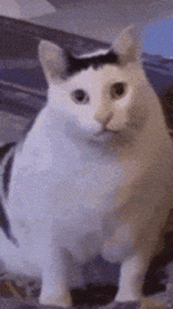

<h1 class="font-bold text-center tracking-wide">
  三、動態樣式綁定
</h1>

<div class="text-center text-2xl text-purple">
  <code>v-bind:class</code>、<code>v-bind:style</code>
</div>

<ExternalLink
  href="https://hackmd.io/efY-3g1JRvKfvrCkDCu-Dg"
  class="absolute bottom-12 right-12"
>
  HackMD
</ExternalLink>

<!--
介紹完 `v-bind` 動態屬性綁定後，接著介紹一下動態樣式綁定

`class` 和 `style` 和其他 HTML 屬性一樣可以使用 `v-bind` 進行動態綁定，不同的是 Vue 有針對 `:class` 和 `:style` 擴充一些功能，讓我們來看一下有哪些不同之處吧 !-
-->

---
layout: center
transition: slide-left
---

<h1 class="font-bold text-center tracking-wide">
  綁定<span v-mark.green.highlight.op30>&nbsp;class&nbsp;</span>
</h1>

<div class="font-bold text-2xl text-center">
  <code text-purple>:class</code>
</div>

<!--
首先先介紹一下綁定 `class` 的方法

[click] ( mark )
-->

---
transition: slide-left
---

<h2 class="font-bold tracking-wide mb-8">
  <code text-purple>:class</code>&nbsp;物件語法 <code>{ }</code>
</h2>

<div class="w-max mb-8">

```html
<div :class="{ <className>: <Truthy | Falsy> }"></div>
```

</div>

<div>
<div class="mb-4 font-bold text-2xl" v-click>舉例 :</div>
<div class="flex items-center gap-x-4 mb-8" v-click="1">
<div class="w-max">

```javascript
{ 'text-red': true }
```

</div>

<div class="flex items-center gap-x-4" v-click>
<div i-heroicons:arrow-long-right-16-solid class="text-2xl text-yellow"></div>

<div class="w-max">

```html
<div class="text-red"></div>
```

</div>
</div>

</div>
</div>

<style>
  code {
    font-size: 1.2rem;
  }
</style>

<!--
v-bind class 綁定物件的時候，

實際渲染的 `class` 是物件的 **key**，而是否要渲染這個 key 則要看這個 key 的 **value** 是真值 ( Truthy ) 還是假值 ( Falsy )。

[click] 舉例來說，這個物件有個 `text-red` 的屬性，如果它的值是 `true`，

[click] 那最終渲染的 HTML 就會有 `text-red` 這個 class。
-->

---
transition: slide-left
---

<div class="flex justify-between items-center gap-x-2 mb-2">

## <code text-purple>:class</code> 綁定物件範例 {.text-3xl .font-bold .mb-2 .tracking-wide}

<PlaygroundLink category="day2" link="VBindClassObject">Playground</PlaygroundLink>

</div>

<div class="horizontal-runner full-height">

```vue {monaco-run} {autorun:true}
<script setup>
import { ref } from 'vue'

const isDanger = ref(false)
</script>

<template>
  <div :class="{ 'text-red': isDanger }">
    我會變紅色哦 !
  </div>
  <button @click="isDanger = !isDanger">Toggle</button>
</template>

<style>
.text-red {
  color: red;
}
</style>
```

</div>

<!--
來看一下這個範例，

`<div>` 標籤的 class 綁定了一個物件，key 是 `text-red`，也就是 `<style>` 標籤的 class 樣式，

`text-red` 這個 key 的值 `isDanger` 是一個 Boolean 型別的響應式狀態，

然後在這個 `button` 按鈕點擊後，`isDanger` 的值會切換成相反的狀態，

(點擊 button) 如果 `isDanger` 是 `true`，那 `<div>` 標籤就會渲染 `text-red` 這個 class，然後文字就會變成紅色。
-->

---
transition: slide-left
---

<div class="flex justify-between items-center gap-x-2 mb-2">

## <code text-purple>:class</code> 綁定物件範例 ( 非布林 ) {.text-3xl .font-bold .mb-2 .tracking-wide}

<PlaygroundLink category="day2" link="VBindClassObjectNotBoolean">Playground</PlaygroundLink>

</div>

<div class="horizontal-runner full-height">

```vue {monaco-run} {autorun:true}
<script setup>
import { ref } from 'vue'

const isDanger = ref('')

function toggleColor() {
  if (isDanger.value) {
    isDanger.value = '' // 空白字串為 Falsy
  } else {
    isDanger.value = 'yes' // 非空白字串為 Truthy
  }
}
</script>

<template>
  <div :class="{ 'text-red': isDanger }">我會變紅色哦 !</div>
  <button @click="toggleColor">Toggle</button>
</template>

<style>
.text-red {
  color: red;
}
</style>
```

</div>

<!--
當然 `isDanger` 不一定要是 Boolean 型別，只要是 **Truthy** 或 **Falsy** 變換都可以動態渲染 `class`

像這個範例中把剛剛 Boolean 型別的 `isDanger` 換成字串型別，空字串是 Falsy，而字串是 Truthy，

button 按鈕點擊後會切換這個字串的值為空字串，或是 `yes` 字串，

( 點擊 button )

所以 class 綁定物件語法蠻適合用在這種單純「開 / 關」的簡單邏輯。
-->

---
transition: slide-left
---

<h2 class="font-bold tracking-wide mb-8">
  <code text-purple>:class</code>&nbsp;陣列語法 <code>[ ]</code>
</h2>

<div class="w-max mb-8">

```html
<div :class="[class1, class2, ...]"></div>
```

</div>

<div class="w-max" v-click>
  <div class="mb-4 font-bold text-2xl">舉例 :</div>
  <div>
  
```javascript
[isActive ? 'active' : 'inactive']
```
  
  </div>
</div>

<style>
  code {
    font-size: 1.2rem;
  }
</style>

<!--
`class` 綁定陣列時，陣列中的每個值都會被當作「**表達式**」執行。

[click] 舉例來說，可以在陣列裡這樣寫，這樣的意思就是當 `isActive` 是 Truthy 的話，就套用 `active` 這個 class 名稱，

反之如果 `isActive` 是 Falsy 的話，就套用 `inactive` 這個 class 名稱。
-->

---
transition: slide-left
---

<div class="flex justify-between items-center gap-x-2 mb-2">

## <code text-purple>:class</code> 綁定陣列範例 {.text-3xl .font-bold .mb-2 .tracking-wide}

<PlaygroundLink category="day2" link="VBindClassArray">Playground</PlaygroundLink>

</div>

<SFCPlayground category="day2" playground="VBindClassArray" />

<!--
這個範例中，button 按鈕的樣式綁定了一個陣列，陣列裡的值是一個表達式，表達式依賴了 `isActive` 這個響應式狀態，

還有一個基本 class 樣式 `btn`，

( 點擊 button ) 點擊了這個按鈕後，執行 `toggleActive` 函式，`isActive` 的狀態會切換成相反狀態，

button 按鈕就會套用 `active` 或 `inactive` class 樣式，

對應的就是 style 標籤裡面的 `active`、`inactive` class 樣式。
-->

---
transition: slide-left
---

<h2 class="font-bold tracking-wide mb-8">
  <code text-purple>class</code>&nbsp;也可以在元件上使用
</h2>

<div class="mb-6" v-click>
<div class="mb-2 font-bold text-2xl">子元件 :</div>

<div class="w-max">

```vue
<!-- Child.vue -->
<template>
  <p class="text-blue font-bold">Hello World !</p>
</template>
```

</div>
</div>

<div class="mb-6" v-click>
<div class="mb-2 font-bold text-2xl">父元件 :</div>

<div class="w-max">

```vue
<!-- Parent.vue -->
<Child class="bg-green" />
```

</div>
</div>

<div class="mb-6" v-click>
<div class="mb-2 font-bold text-2xl">渲染結果 :</div>

<div class="w-max">

```vue
<p class="text-blue font-bold bg-green">Hello World !</p>
```

</div>
</div>

<style>
  code {
    font-size: 1.125rem;
  }
</style>

<!--
`class` 除了能在一般 HTML 元素上使用以外，在 Vue 中也可以使用在元件標籤上，

[click] 假設子元件 `Child.vue` 的頂層元素是一個 `p` 標籤，它自己有既定的 class `text-blue、`font-bold`，

[click] 然後我們可以在父元件 `Parent.vue` 對子元件的標籤直接加上 class `bg-green`

[click] 最後實際渲染的 HTML 會是這樣合併起來，

不過要注意 HTML class 有權重和優先順位，

以這個例子來說，在父元素中對子元素標籤上新增的 class，渲染結果會排列在 `p` 標籤的最後面，

依照 HTML 和 CSS 的規則，後面的 class 如果其中有樣式屬性和前面的 class 樣式屬性重複，那後面會覆蓋前面。
-->

---
layout: center
transition: slide-left
---

<h1 class="font-bold text-center tracking-wide">
  綁定<span v-mark.purple.highlight.op30>&nbsp;style&nbsp;</span>
</h1>

<div class="font-bold text-2xl text-center">
  <code text-purple>:style</code>
</div>

<!--
除了綁定 `class` 有物件和陣列語法以外，綁定 `style` 也有物件和陣列語法。

[click] ( mark )
-->

---
transition: slide-left
---

<h2 class="font-bold tracking-wide mb-8">
  <code text-purple>:style</code>&nbsp;物件語法 <code>{ }</code>
</h2>

<div class="w-max mb-8" v-click>

<div class="text-2xl mb-2"><span class="font-bold">小駝峰 ( camelCase )</span> 屬性命名 :</div>

```html
<div :style="{ fontSize: '2rem', backgroundColor: 'red' }">
  Hello World !
</div>
```

</div>

<div class="w-max mb-8" v-click="1">

<div class="text-2xl mb-2"><span class="font-bold">烤肉串 ( kebab-case )</span> 屬性命名 :</div>

```html
<div :style="{ 'font-size': '2rem', 'background-color': 'red' }">
  Hello World !
</div>
```

</div>

<style>
  code {
    font-size: 1.125rem;
  }
</style>

<!--
`:style` 綁定物件的時候，物件的 **key** 對應的是 CSS 屬性，

但因為 `style` 是直接將 CSS 樣式的屬性和值暴露出來，所以 **不會** 使用 Truthy 或 Falsy 的值來判斷是否渲染 style 樣式。

[click] 而且 style 物件的屬性稍微特別一點，CSS 原本的屬性名稱通常是用烤肉串命名方式，但是在 style 綁定物件中，屬性名稱要使用小駝峰 ( camelCase ) 的方式來命名，

當然還是可以維持原本減號分隔的烤肉串命名方式，不過需要用單引號或雙引號把屬性包起來。
-->

---
transition: slide-left
---

<div class="flex justify-between items-center gap-x-2 mb-2">

## <code text-purple>:style</code> 綁定物件範例 {.text-3xl .font-bold .mb-2 .tracking-wide}

<PlaygroundLink category="day2" link="VBindStyleObject">Playground</PlaygroundLink>

</div>

<div class="horizontal-runner full-height">

```vue {monaco-run} {autorun:true}
<script setup>
import { ref } from 'vue'

const bgColor = ref('yellow')
</script>

<template>
  <div :style="{ backgroundColor: bgColor, fontSize: '2rem', color: 'black' }">
    我的背景顏色會變 !
  </div>
  <button @click="bgColor = 'red'">切換紅色</button>
  <button @click="bgColor = 'yellow'">切換黃色</button>
</template>
```

</div>

<!--
看一下 style 綁定物件的範例，

這裡有一行文字，它的背景顏色 `backgroundColor` 綁定了響應式狀態 `bgColor`，預設是黃色的

另外有一個切換紅色的按鈕，和一個切換黃色的按鈕，這兩個按鈕都會修改 `bgColor` 的狀態，

( 點擊 button )
-->

---
transition: slide-left
---

<div class="flex justify-between items-center gap-x-2 mb-2">

## <code text-purple>:style</code> 綁定物件範例 - 使用 `computed` {.text-3xl .font-bold .mb-2 .tracking-wide}

<PlaygroundLink category="day2" link="VBindStyleObjectWithComputed">Playground</PlaygroundLink>

</div>

<div class="horizontal-runner full-height">

```vue {monaco-run} {autorun:true}
<script setup>
import { ref, computed } from 'vue'

const textColor = ref('green')

const styleObj = computed(() => {
  return {
    fontSize: '2rem',
    fontWeight: 'bold',
    color: textColor.value,
    backgroundColor: textColor.value === 'green' ? 'aquamarine' : 'cyan'
  }
})

function changeTextColorToGreen() {
  textColor.value = 'green'
}

function changeTextColorToBlue() {
  textColor.value = 'blue'
}
</script>

<template>
  <div :style="styleObj">我的文字樣式會變 !</div>
  <button @click="changeTextColorToGreen">切換綠色</button>
  <button @click="changeTextColorToBlue">切換藍色</button>
</template>
```

</div>

<!--
這是稍微進階一點使用到 `computed` 計算屬性 API 的範例，

在這個元件中，`div` 的 `style` 綁定了一個 `computed` 響應式物件 `styleObj`，

其中回傳的物件裡面，`color` 和 `backgroundColor` 會隨著另一個響應式狀態 `textColor` 的變化而響應更新狀態，

( 點擊 button )
-->

---
layout: center
transition: slide-left
---

<div class="text-xl text-center">

<span text-purple>`computed`</span> 就是 ~~響應響應式狀態的響應式狀態~~

</div>

<div class="w-40 mx-auto">
  
</div>

<!--
`computed` 可以當作是「響應響應式狀態的響應式狀態」，當作預習一下就好，後面會介紹 `computed` 的用法。
-->

---
layout: center
transition: slide-left
---

<h2 class="text-center font-bold tracking-wide mb-8">
  <code text-purple>:style</code>&nbsp;陣列語法 <code>[ ]</code>
</h2>

<div class="w-max mx-auto mb-8" v-click>

```html
<div :style="[
  { fontSize: '2rem' },
  { backgroundColor: 'red', fontSize: '3rem' },
]">
  Hello World !
</div>
```

</div>

<style>
  code {
    font-size: 1.125rem;
  }
</style>

<!--
`style` 綁定陣列的時候，可以綁定多個樣式物件，

[click] 在陣列中，順序排後的樣式物件裡面的屬性，會覆蓋順序較前的樣式物件中裡面相同的屬性，

向這邊有兩個 `fontSize`，順序在後的 `fontSize` `3rem` 會覆蓋順序在前面的 `fontSize` `2rem`。
-->

---
transition: slide-left
---

<div class="flex justify-between items-center gap-x-2 mb-2">

## <code text-purple>:style</code> 綁定陣列範例 {.text-3xl .font-bold .mb-2 .tracking-wide}

<PlaygroundLink category="day2" link="VBindStyleArray">Playground</PlaygroundLink>

</div>

<div class="horizontal-runner full-height">

```vue {monaco-run} {autorun:true}
<script setup>
import { ref } from 'vue'

const baseStyles = ref({
  fontSize: '2rem'
})

const overridingStyles = ref({
  fontSize: '3rem',
  backgroundColor: 'red'
})
</script>

<template>
  <div :style="[baseStyles, overridingStyles]">
    Hello World !
  </div>
</template>
```

</div>

<!--
看一下實際結果，因為 `baseStyles` 和 `overridingStyles` 都有 `fontSize` 屬性，

排序在後的 `overridingStyles` 的 `fontSize` 值 `3rem` 會覆蓋 `baseStyles` 的 `fontSize` 值 `2rem`，並且會保留 `backgorundColor` 紅色樣式。

( 註解 `3rem` )
-->
