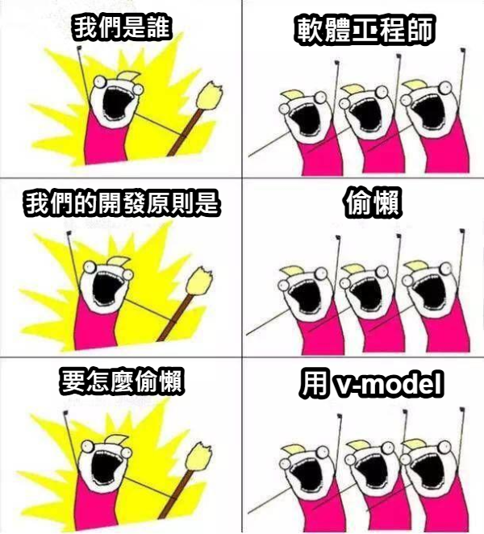

<div
  transition duration-400
  :class="$clicks > 0 ? '-translate-y-16' : 'translate-y-0'"
>
  <h1 class="font-bold text-center tracking-wide">
    五、雙向綁定
  </h1>
  
  <div class="text-center text-2xl text-purple mb-8">
    <code>v-model</code>
  </div>
</div>

<div
  transition duration-400
  class="absolute left-1/2 top-1/2 -translate-x-1/2 translate-y-0 w-72 rounded overflow-hidden"
  :class="$clicks > 0 ? 'op100' : 'op0'"
  v-click
>
  
</div>

<ExternalLink
  href="https://hackmd.io/Uy3kMCSZQlCk8yTPWf3fJQ"
  class="absolute bottom-12 right-12"
>
  HackMD
</ExternalLink>

<!--
在網頁中，常常會遇到需要使用者輸入表單的情境，想像一下在網頁的輸入框中輸入文字或修改文字後，

[click] 頁面上另一個地方的文字也會即時更新，這就是「**雙向綁定 v-model**」的魔法 !
-->

---
layout: center
transition: slide-left
---

<div class="w-max rounded-xl flex items-center justify-center px-6 py-4 mx-auto mb-8">
  <code><span class="block text-purple text-3xl font-bold px-2 py-1">v-model</span></code>
</div>

<div class="flex items-center gap-x-4" v-click>
  <div class="bg-green-400/35 rounded-lg px-5 py-3">
    <span class="text-2xl font-bold">響應式狀態</span>
  </div>
  <div i-heroicons:arrows-right-left-20-solid class="text-2xl"></div>
  <div class="bg-orange-400/35 rounded-lg px-5 py-3">
    <span class="text-2xl font-bold">畫面 ( 輸入框 )</span>
  </div>
</div>

<div class="flex items-center justify-center gap-x-4 mt-6" v-click>
  <div text-purple text-xl><code>:value</code></div>
  <div>&</div>
  <div text-purple text-xl><code>@input</code> / <code>@change</code></div>
</div>

<!--
在 Vue 中，

[click] `v-model` 可以實現狀態和畫面雙向綁定的魔法效果，

當我們用 JavaScript 修改響應式狀態，畫面也會跟著更新；當我們操作修改網頁畫面，在背後的響應式狀態也會跟著更新，雖然聽起來很神奇，

[click] 不過在前面表單的 input、change 事件範例中就已經把原理窺探過一遍了。
-->

---
transition: slide-left
---

<div
  transition duration-400
  class="[&_code]:text-lg space-y-8 w-70% mx-auto"
  :class="$clicks > 3 ? '-translate-x-40' : 'translate-x-0'"
>
<div>

<div class="text-2xl font-bold mb-4">單行文字 - <code>text</code></div>

```html {*|3|4|3-4}
<input
  type="text"
  :value="name"
  @input="event => name = event.target.value"
/>
```

</div>

<div>

<div class="text-2xl font-bold mb-4">複選框 - <code>checkbox</code></div>

```html {*|3|4|3-4}{at:0}
<input
  type="checkbox"
  :checked="isChecked"
  @change="event => isChecked = event.target.checked"
/>
```

</div>
</div>

<div class="absolute right-6 top-1/2 -translate-y-1/2 w-72" v-click>
  
</div>

<!--
要讓輸入框 `<input>` 綁定響應式狀態時，會需要使用 `v-bind` 綁定

[click] `value` 或 `checked` 值，這樣 `name` 或 `isChecked` 響應式狀態如果有變化，對應表單元素的屬性值也會有變化，

[click] 然後再使用 `v-on` 監聽 `input` 或 `change` 事件，觸發事件後將值賦予響應式狀態

[click] 有了綁定屬性和監聽事件這兩項流程，就可以實現畫面和狀態的同步更新，也符合 **雙向綁定** 的概念，

[click] 不過大家可以發現到，這樣寫似乎太冗長了 !

所以 `v-model` 這個魔法咒語就派上用場了，它會大幅降低我們實現雙向綁定的負擔
-->

---
transition: slide-up
---

<div class="flex justify-between items-center gap-x-2 mb-2">

## <code text-purple>v-model</code> - 輸入框雙向綁定 {.text-3xl .font-bold .mb-2 .tracking-wide}

<PlaygroundLink category="day2" link="VModelInputTextDemo">Playground</PlaygroundLink>

</div>

<div class="horizontal-runner full-height">

```vue {monaco-run} {autorun:true}
<script setup>
import { ref } from 'vue'
const name = ref('')
</script>

<template>
  <div>
    <h2>你好，{{ name }}！</h2>
    <input
      v-model="name"
      placeholder="請輸入你的名字"
    />
  </div>
</template>
```

</div>

<!--
看一下這個範例，input 這邊我們不綁定 value，也不監聽 input 事件，而是用 `v-model` 直接綁定響應式狀態 `name`，

( 操作 ) 這樣我們在輸入框輸入的時候，畫面中用文本插植綁定同樣 `name` 的地方也會即時更新，

( 操作 ) 反之，`name` 預設是空字串，如果我們修改 `name` 狀態的預設值，輸入框預設的值也會是同樣的值。

這樣比起我們自己綁定 `value` 狀態和監聽 input 事件更簡潔，因為 `v-model` 已經幫我們做了這些事情。
-->

---
layout: center
transition: slide-left
---

<div class="w-72 rounded-lg overflow-hidden">
  
</div>

<!--
總而言之，`v-model` 大家一定要學會，它是個很棒的東西，也是眾多 Vue API 中相當有特色的功能。
-->

---
transition: slide-left
---

<div class="relative z-20 m-auto w-max mt-8 space-y-8">

<div class="flex items-center gap-x-2 mb-2" v-click>
<h3 class="font-bold">單行文字 ( Text )</h3>

<div >

```html
<input type="text" />
```

</div>
</div>

<div class="flex items-center gap-x-2 mb-2" v-click>
<h3 class="font-bold">多行文本 ( Multiline Text )</h3>

<div >

```html
<textarea>

```

</div>
</div>

<div class="flex items-center gap-x-2 mb-2" v-click>
<h3 class="font-bold">複選框 ( Checkbox )</h3>

<div >

```html
<input type="checkbox" />
```

</div>
</div>

<div class="flex items-center gap-x-2 mb-2" v-click>
<h3 class="font-bold">單選按鈕 ( Radio )</h3>

<div >

```html
<input type="radio" />
```

</div>
</div>

<div class="flex items-center gap-x-2 mb-2" v-click>
<h3 class="font-bold">選擇器 ( Select )</h3>

<div >

```html
<select>
```

</div>
</div>

</div>

<div
  transition-all duration-500
  class="absolute z-10 left-1/2 top-1/2 -translate-x-1/2 -translate-y-100% scale-250 blur-[0px]"
  :class="$clicks > 0 ? 'op25 blur-[2px]' : 'op50'"
>
  <span class="text-5xl font-bold">v-model</span>
</div>

<style>
  code {
    font-size: 1.05rem;
  }
</style>

<!--
接下來會介紹一下，在

[click] 單行文字

[click] 多行文本

[click] 複選框

[click] 單選按鈕

[click] 選擇器

這些常見的表單元素中，如何使用 `v-model` 實現雙向綁定。
-->

---
layout: center
transition: slide-left
---

<h2 class="text-3xl text-center font-bold mb-4">
  單行文字 - Text
</h2>

<div class="[&_code]:text-lg">

```html
<input v-model="message" />
```

</div>

<!--
input 預設 `type` 類行為單行文字 `text`，直接使用 `v-model` 進行雙向綁定就可以了。
-->

---
transition: slide-left
---

<div class="flex justify-between items-center gap-x-2 mb-2">

## <code text-purple>v-model</code> - 單行文字 ( Text ) {.text-3xl .font-bold .mb-2 .tracking-wide}

<PlaygroundLink category="day2" link="VModelInputText">Playground</PlaygroundLink>

</div>

<div class="horizontal-runner full-height">

```vue {monaco-run} {autorun:true}
<script setup>
import { ref } from 'vue'
const message = ref('')
</script>

<template>
  <p>訊息 : {{ message }}</p>
  <input
    v-model="message"
    placeholder="請輸入訊息"
  />
</template>
```

</div>

<!--
( 操作 ) 和上一個範例一樣，簡單在 input 上使用 `v-model` 可以快速綁定畫面和狀態，

不過有個小小的地方要注意，像中文這類 IME 輸入法，`v-model` 並不會在「拼字」的時候觸發 input 事件更新畫面 ( 操作 ... )

要在選字按下 Enter 後，或是滑鼠點擊其他地方才會觸發 input 事件更新畫面。
-->

---
layout: center
transition: slide-left
---

<h2 class="text-3xl text-center font-bold mb-4">
  多行文本 - Multiline Text
</h2>

<div class="[&_code]:text-lg mb-8">

```html
<textarea v-model="message"></textarea>
```

</div>

<div
  transition duration-500
  class="[&_code]:text-lg text-center w-max mx-auto" v-mark.red.linethrough.op80.delay800
  :class="$clicks > 0 ? 'op100' : 'op0'"
>

```html
<textarea>{{ message }}</textarea>
```

</div>

<div
  i-heroicons:x-circle-16-solid
  transition duration-500
  class="text-4xl text-red absolute left-1/2 -translate-x-1/2 bottom-36 -z-10"
  :class="$clicks > 0 ? 'translate-y-0 op100' : '-translate-y-10 op0'"
></div>

<!--
如果需要使用者輸入多行文字，可以使用 textarea 網頁元素搭配 v-model 進行雙向綁定。

[click] 但是要注意不要在 textarea 標籤中使用文本插植綁定狀態，這樣輸入是不會更新狀態的
-->

---
transition: slide-left
---

<div class="flex justify-between items-center gap-x-2 mb-2">

## <code text-purple>v-model</code> - 多行文本 ( Multiline Text ) {.text-3xl .font-bold .mb-2 .tracking-wide}

<PlaygroundLink category="day2" link="VModelTextarea">Playground</PlaygroundLink>

</div>

<div class="horizontal-runner full-height">

```vue {monaco-run} {autorun:true}
<script setup>
import { ref } from 'vue'
const message = ref('')
</script>

<template>
  <textarea
    v-model="message"
    placeholder="輸入多行訊息"
  ></textarea>
  <pre>原始狀態 : {{ JSON.stringify(message) }}</pre>
  <div>多行文字訊息 :</div>
  <p style="white-space: pre-line;">{{ message }}</p>
</template>
```

</div>

<!--
textarea 的範例中一樣對 `message` 狀態進行雙向綁定，

可以看到這邊有一個使用 `JSON.stringify` 把原始文字格式化成 JSON 字串方便我們檢視

( 操作 ) 在多行輸入框中可以換行 ...

原始狀態在換行的時候會有斜線 n (`\n`)，多行文字訊息綁定 `message` 的地方狀態會出現換行的效果。
-->

---
layout: center
transition: slide-left
---

<h2 class="text-3xl text-center font-bold mb-4">
  複選框 - Checkbox
</h2>

<div class="[&_code]:text-lg mb-8">

```html
<input type="checkbox" v-model="checked" />
```

</div>

<div class="text-center text-2xl" v-click>
  <code v-mark.yellow.delay400="1">event.target.checked</code>
</div>

<!--
把 input `type` 類型設定為 `checkbox` 會把輸入框變成一個勾選框，也就是複選框

在 checkbox 複選框中使用 `v-model` 綁定狀態的時候，

[click] 實際上是對應到複選框事件中的 `checked` 狀態，而不是 `event.target.value`。
-->

---
transition: slide-left
---

<div class="flex justify-between items-center gap-x-2 mb-4">

## <code text-purple>v-model</code> - 複選框 ( Checkbox ) {.text-3xl .font-bold .mb-2 .tracking-wide}

<PlaygroundLink category="day2" link="VModelInputCheckbox">Playground</PlaygroundLink>

</div>

<div class="horizontal-runner full-height">

```vue {monaco-run} {autorun:true}
<script setup>
import { ref } from 'vue'
const checked = ref(false)
</script>

<template>
  <input
    type="checkbox"
    id="checkbox"
    v-model="checked"
  />
  <label for="checkbox">{{ checked }}</label>
</template>
```

</div>

<!--
來看一下範例，

這邊有用 label 標籤使用 `for` 屬性綁定 `id` 為 `checkbox` 的 input，所以點擊 label 文字也可以勾選這個複選框 ( 操作 )

複選框 `v-model` 綁定一個預設 `false` 的響應式狀態，有勾選是 true，取消勾選就是 false。
-->

---
layout: center
transition: slide-left
---

<h2 class="text-3xl text-center font-bold mb-4">
  改變真假值 - <code>true-value</code> & <code>false-value</code>
</h2>

<div class="[&_code]:text-lg">

```html {*|4-5}
<input
  type="checkbox"
  v-model="toggle"
  true-value="同意"
  false-value="不同意"
/>
```

</div>

<!--
如果 checkbox 使用 `v-model` 綁定原始型別，像字串、數值、布林的這些值，那它還有另一個功能，

[click] 可以在屬性中使用 `true-value` 和 `false-value` 來設定勾選和取消勾選時的值，

不過使用 `true-value` 和 `false-value` 屬性後，就不需要加上 `value`，避免混淆。
-->

---
transition: slide-left
---

<div class="flex justify-between items-center gap-x-2 mb-4">

## <code text-purple>v-model</code> - `true-value` & `false-value` {.text-3xl .font-bold .mb-2 .tracking-wide}

<PlaygroundLink category="day2" link="VModelInputCheckboxWithTrueAndFalseValue">Playground</PlaygroundLink>

</div>

<div class="horizontal-runner full-height">

```vue {monaco-run} {autorun:true}
<script setup>
import { ref } from 'vue'

const conclusion = ref('🤔') // 加上預設值
</script>

<template>
  <label>
    <input
      type="checkbox"
      v-model="conclusion"
      true-value="當然可以，攪一起吃才爽🤪"
      false-value="不行，太邪門了😡"
    />
    咖哩飯可以攪拌嗎 ?
  </label>
  <div>{{ conclusion }}</div>
</template>
```

</div>

<!--
舉個例子，不知道大家會不會攪拌咖哩飯 ?
-->

---
transition: slide-left
---

<div class="text-2xl font-bold text-center tracking-wide mt-20 mb-8">
  Checkbox 綁定陣列保存多個值
</div>

<div class="w-max mx-auto">

````md magic-move {lines:true}
```vue {*|4}
<script setup>
import { ref } from 'vue'

const staff = ref([])
</script>
```

```vue {*|4,8-10}
<script setup>
import { ref } from 'vue'

const staff = ref([])
</script>

<template>
  <input type="checkbox" v-model="staff" value="kevin" />
  <input type="checkbox" v-model="staff" value="tim" />
  <input type="checkbox" v-model="staff" value="frank" />
</template>
```
````

</div>

<!--
不過 checkbox 不只可以綁定布林值，還可以綁定陣列保存多選的 value 值，

[click] 如果有多個複選框，可以將 `v-model` 綁定同一個陣列類型的響應式狀態，

[click] 然後把多個 `checkbox` 複選框元素的 `v-model`

[click] 綁定同樣的這個 `staff` 響應式狀態，

這樣這個 `staff` 狀態可以在這些複選框有勾選的時候，保存它的 value 值到陣列裡面。
-->

---
transition: slide-left
---

<div class="flex justify-between items-center gap-x-2 mb-2">

## <code text-purple>v-model</code> - 多個複選框 ( Checkbox ) {.text-3xl .font-bold .mb-2 .tracking-wide}

<PlaygroundLink category="day2" link="VModelInputMultiCheckbox">Playground</PlaygroundLink>

</div>

<div class="horizontal-runner full-height">

```vue {monaco-run} {autorun:true}
<script setup>
import { ref } from 'vue'

const allStaff = ['kevin', 'tim', 'frank']
const staff = ref([]) // 陣列類型的響應式狀態

function selectAll() {
  staff.value = allStaff
}

function cancelAll() {
  staff.value = []
}
</script>

<template>
  <div>
    <button @click="selectAll">全選</button>
    <button @click="cancelAll">清除選取</button>
  </div>

  <label>
    <input type="checkbox" v-model="staff" value="kevin" />
    Kevin
  </label>

  <label>
    <input type="checkbox" v-model="staff" value="tim" />
    Tim
  </label>

  <label>
    <input type="checkbox" v-model="staff" value="frank" />
    Frank
  </label>

  <div>已勾選員工 : <pre>{{ staff }}</pre></div>
</template>
```

</div>

<!--
這邊我有一個和剛剛一樣的 `staff` 響應式狀態，預設是空陣列

然後模板中有三個用 label 標籤包起來的 checkbox 複選框，它們都綁定同樣的 `staff` 狀態，

和單一個複選框不一樣的是，它們有自己的 `value` 值，會在勾選狀態下加入到這個 `staff` 陣列中 ( 操作... )

而且可以看到加入陣列的順序是按照勾選的順序，

我在這裡還有另外添加"全選"和"取消全選"兩個功能按鈕，

"全選"對應的是 `selectAll` 這個函式，會把上面這個全部員工的陣列賦予 `staff` 狀態，然後模板中的複選框因為有用 `v-model` 綁定 `staff`，所以會按照相同的 `value` 值自動勾選

"清除選取"的話比較簡單，就把 `staff` 狀態清空成空陣列就好了。
-->

---
layout: center
transition: slide-left
---

<h2 class="text-3xl text-center font-bold mb-4">
  單選按鈕 - Radio
</h2>

<div class="[&_code]:text-base mb-8">

```html
<label>
  <input type="radio" value="credit" v-model="paymentMethod"/>
  信用卡
</label>

<label>
  <input type="radio" value="cash" v-model="paymentMethod"/>
  現金
</label>
```

</div>

<!--
通常 `radio` 單選按鈕在頁面上會至少存在兩個，和 `checkbox` 複選框不一樣的地方是，

`checkbox` 可以綁定同一個狀態，也可以綁定不同的狀態，但是 `radio` 單選框是需要綁定同一個狀態，

像這裡兩個單選按鈕的 `v-model` 都綁定同一個 `paymentMethod` 狀態，才會有網頁上同樣分類的單選效果。
-->

---
transition: slide-left
---

<div class="flex justify-between items-center gap-x-2 mb-4">

## <code text-purple>v-model</code> - 單選按鈕 ( Radio ) {.text-3xl .font-bold .mb-2 .tracking-wide}

<PlaygroundLink category="day2" link="VModelInputRadio">Playground</PlaygroundLink>

</div>

<div class="horizontal-runner full-height [&_label]:block">

```vue {monaco-run} {autorun:true}
<script setup>
import { ref } from 'vue'

const rating = ref('')
</script>

<template>
  <h2>滿意度分數 : {{ rating }}</h2>

  <label>
    <input type="radio" value="5" v-model="rating"/>
    <span>😄 非常滿意</span>
  </label>

  <label>
    <input type="radio" value="4" v-model="rating"/>
    <span>😊 滿意</span>
  </label>

  <label>
    <input type="radio" value="3" v-model="rating"/>
    <span>😌 尚可</span>
  </label>

  <label>
    <input type="radio" value="2" v-model="rating"/>
    <span>😑 不滿意</span>
  </label>

  <label>
    <input type="radio" value="1" v-model="rating"/>
    <span>😡 非常不滿意</span>
  </label>
</template>
```

</div>

<!--
來看一個滿意度調查的範例，這五個單選按鈕都是綁定同一個 `rating` 響應式狀態，

滿意度分數這邊綁定 `rating` 狀態顯示，

( 操作 ) 這樣在點選單選按鈕的時候，分數 `rating` 就會按照每個單選的 `value` 值顯示更新。
-->

---
layout: center
transition: slide-left
---

<h2 class="text-3xl text-center font-bold mb-4">
  選擇器 - Select
</h2>

<div class="[&_code]:text-base mb-8">

```html {*|4-7|3,8|*|4}
<div>Selected: {{ selected }}</div>

<select v-model="selected">
  <option disabled value="">Please select one</option>
  <option value="a">A</option>
  <option value="b">B</option>
  <option value="c">C</option>
</select>
```

</div>

<!--
前面介紹了不同類型的 `input` 和多行文本 `textarea` 網頁元素，在表單中還有常見的一個元素，那就是 `select`，

[click] `select` 需要搭配 `option` 選項元素，要進行雙向綁定的話是要在 `select` 元素上使用，而不是 `option` 中使用，這點要特別注意，

而 `option` 元素需要設定 `value` 屬性，在選擇器選取的時候，

[click] 會把對應的 `value` 值賦予選擇器 `select` `v-model` 綁定的狀態，

[click] 如果 `v-model` 綁定的狀態有改變，那選項也會自動選取到有同樣 `value` 值的選項。

[click] 設計選擇器的時候，有時候會在第一個選項加上一個 disabled 表示不可選，而且 `value` 又是空值的選項，

這樣做的目的是讓使用者一旦選擇選項後，就無法恢復到未選擇的狀態，

當然如果要讓使用者可以恢復未選擇的預設狀態，把 `disabled` 拿掉就可以了。
-->

---
transition: slide-left
---

<div class="flex justify-between items-center gap-x-2 mb-4">

## <code text-purple>v-model</code> - 選擇器 ( Select ) {.text-3xl .font-bold .mb-2 .tracking-wide}

<PlaygroundLink category="day2" link="VModelSelect">Playground</PlaygroundLink>

</div>

<div class="horizontal-runner full-height [&_label]:block">

```vue {monaco-run} {autorun:true}
<script setup>
import { ref } from 'vue'

const drinkSize = ref('')
</script>

<template>
  <select v-model="drinkSize">
    <option disabled value="">請選擇</option>
    <option value="l">中</option>
    <option value="xl">大</option>
  </select>

  <div>飲料尺寸 : {{ drinkSize }}</div>
</template>
```

</div>

<!--
看一下範例，這邊第一個選項的文字是"請選擇"，並且有 `disabled` 屬性禁用，

( 操作 ) 所以當我們點開選項並且選擇後，第一個"請選擇"選項是無法選取的，

然後 `select` 綁定了 `drinkSize` 狀態，並且顯示在畫面上，

當我們選取"中杯"，飲料尺寸這裡就顯示 `l`，如果選取"大杯"，飲料尺寸就顯示 `xl`，

台灣很多飲料是沒有小杯的選項 😏

( 編輯 ) 其實 `option` 也可以不用 `value` 屬性 ...

這樣綁定的狀態 `drinkSize` 會是選項的文本內容，不過通常還是會建議設定 `value` 把要傳送給後端的資料和畫面顯示分開，

尤其是在有多語系的網頁，文本常常是不一樣的語言，而 `value` 可以統一用英文表示。
-->

---
transition: slide-left
---

<div class="flex justify-between items-center gap-x-2 mb-4">

## <code text-purple>v-model</code> - 選擇器綁定物件 {.text-3xl .font-bold .mb-2 .tracking-wide}

<PlaygroundLink category="day2" link="VModelSelectBindObject">Playground</PlaygroundLink>

</div>

<div class="horizontal-runner full-height [&_label]:block">

```vue {monaco-run} {autorun:true}
<script setup>
import { ref } from 'vue'

const drinkSize = ref(null)
</script>

<template>
  <select v-model="drinkSize">
    <option disabled :value="null">請選擇</option>
    <option :value="{ size: 'm', capacity: 360, unit: 'ml' }">中</option>
    <option :value="{ size: 'l', capacity: 480, unit: 'ml' }">大</option>
  </select>

  <div>飲料尺寸 : <pre>{{ drinkSize }}</pre></div>
</template>
```

</div>

<!--
有時候一個選項對後端來說是包含比較多資訊的，這個時候 `option` 的 `value` 就可以用 `v-bind` 綁定不同的物件內容，

( 操作 ) 這邊我把剛剛飲料尺寸的 `value` 改成綁定物件，然後在下面把 `drinkSize` 結果印出來

( 操作 ) 這樣在選取的時候，綁定的響應式狀態實際上會是一包物件包含選項的資訊，這對一些稍微複雜的表單很有用。

像這個飲料尺寸的例子，除了尺寸 `size` 外，可能還需要它的容量 `capacity`，還有單位 `ml`。
-->

---
transition: slide-left
---

<h2
  transition duration-400
  class="important-text-4xl font-bold text-center tracking-wide mt-4 mb-8"
  :class="$clicks > 0 ? 'translate-y-30' : 'translate-y-45'"
>
  事件修飾符
</h2>

<div class="flex gap-x-8 w-max mx-auto translate-y-30">
  <div class="text-2xl" v-click><code>.lazy</code></div>
  <div class="text-2xl" v-click><code>.number</code></div>
  <div class="text-2xl" v-click><code>.trim</code></div>
</div>

<!--
`v-model` 和 `v-on` 監聽事件一樣，也有一些修飾幅可以使用，

[click] 像是 `lazy` 相當於把 `input` 監聽的 `input` 事件改為監聽 `change` 事件，

[click] `number` 會把綁定的值自動轉換成數值，如果無法把字串的內容轉換成數值，那會 fallback 回原本的字串。

[click] `trim` 會自動去除輸入內容頭尾的空白。
-->

---
transition: slide-left
---

<h2 class="text-3xl text-center font-bold mt-20">
  <code text-purple>v-model</code> 修飾符 - <code>.lazy</code>
</h2>

<div class="[&_code]:text-lg text-center w-max mx-auto mt-24">

```html
<input v-model.lazy="message" />
```

</div>

<div class="text-xl text-center font-bold mt-8" v-click>
  將 <code>&lt;input&gt;</code> 監聽的 <code text-purple>input</code> 事件改為監聽 <code text-purple>change</code> 事件
</div>

<!--
在預設情況下，`<input>` 使用 `v-model` 雙向綁定所監聽的事件是 `input`，

[click] 如果使用 `lazy` 修飾，會改為使用 `change` 事件監聽，

也就是在使用者輸入內容過程中，並不會立即同步響應式狀態，而是要等到輸入框失去焦點，或是按下 Enter 鍵時才會更新。
-->

---
transition: slide-left
---

<h2 class="text-3xl text-center font-bold mt-20">
  <code text-purple>v-model</code> 修飾符 - <code>.number</code>
</h2>

<div class="[&_code]:text-lg text-center w-max mx-auto mt-24">

```html
<input v-model.number="age" />
```

</div>

<div class="flex flex-col items-center gap-y-2 text-xl text-center font-bold mt-8" v-click>
  <span>將綁定的值自動轉換為數值</span>
  <span><code text-blue>parseFloat()</code></span>
</div>

<!--
表單輸入元素大部分都是字串值，

[click] 但是如果要把這些輸入的字串在綁定的響應式狀態中以「數值」類型儲存，像是這個年齡 `age` ，可以使用 `number` 修飾。

`number` 修飾符相當於使用 JavaScript 的 `parseFloat()` 方法。
-->

---
transition: slide-left
---

<h2 class="text-3xl text-center font-bold mt-20">
  <code text-purple>v-model</code> 修飾符 - <code>.trim</code>
</h2>

<div class="[&_code]:text-lg text-center w-max mx-auto mt-24">

```html
<input v-model.trim="name" />
```

</div>

<div class="flex flex-col items-center gap-y-2 text-xl text-center font-bold mt-8" v-click>
  <span>自動去除輸入內容頭尾的空白字符</span>
  <span><code text-blue>trim()</code></span>
</div>

<!--
有時候我們的表單元素使用者會在頭尾多打空白字符，如果我們不要這個頭尾空白可以使用 `trim` 修飾符，

[click] 自動把輸入內容綁定的字串頭尾空白字符去除掉，

相當於使用 JavaScript 的 `trim()` 方法。
-->

---
transition: slide-left
---

<div class="flex justify-between items-center gap-x-2 mb-4">

## <code text-purple>v-model</code> - 選擇器綁定物件 {.text-3xl .font-bold .mb-2 .tracking-wide}

<PlaygroundLink category="day2" link="VModelProfileExample">Playground</PlaygroundLink>

</div>

<div class="horizontal-runner full-height [&_label]:block">

```vue {monaco-run} {autorun:true}
<script setup>
import { ref } from 'vue'

const profile = ref({
  name: '', // 姓名
  gender: '', // 性別
  age: null, // 年齡
  email: '', // Email
  city: '', // 縣市
  district: '', // 行政區
  address: '', // 地址
  introduction: '', // 自我介紹
  subscribe: false, // 是否訂閱優惠訊息
  channels: [], // 得知此服務的管道
})
</script>

<template>
  <div>
    <h1>基本資料表單</h1>

    <!-- 姓名 -->
    <div>
      <label>
        姓名：
        <input type="text" v-model.trim="profile.name" placeholder="請輸入姓名" />
      </label>
    </div>

    <!-- 性別 -->
    <div>
      <label>性別：</label>
      <label>
        <input type="radio" value="male" v-model="profile.gender" />
        男
      </label>
      <label>
        <input type="radio" value="female" v-model="profile.gender" />
        女
      </label>
      <label>
        <input type="radio" value="other" v-model="profile.gender" />
        其他
      </label>
    </div>

    <!-- 年齡 -->
    <div>
      <label>
        年齡：
        <input type="text" v-model.number="profile.age" placeholder="請輸入年齡" />
      </label>
    </div>

    <!-- Email -->
    <div>
      <label>
        Email：
        <input type="email" v-model.trim="profile.email" placeholder="請輸入 Email" />
      </label>
    </div>

    <!-- 縣市 -->
    <div>
      <label>縣市：</label>
      <select v-model="profile.city">
        <option value="" disabled>請選擇縣市</option>
        <option value="TW-TPE">台北市</option>
        <option value="TW-NWT">新北市</option>
        <option value="TW-TXG">台中市</option>
        <option value="TW-KHH">高雄市</option>
      </select>
    </div>

    <!-- 區域 -->
    <div>
      <label>行政區：</label>
      <select v-model="profile.district">
        <option value="" disabled>請選擇區域</option>
        <option value="Xinyi">信義區</option>
        <option value="Wugu">五股區</option>
        <option value="Wuri">烏日區</option>
        <option value="Zuoying">左營區</option>
      </select>
    </div>

    <!-- 地址 -->
    <div>
      <label>
        地址：
        <input type="text" v-model.lazy.trim="profile.address" placeholder="請輸入詳細地址" />
      </label>
    </div>

    <!-- 自我介紹 -->
    <div>
      <label>自我介紹：</label>
      <textarea
        v-model="profile.introduction"
        placeholder="請輸入自我介紹"
      ></textarea>
    </div>

    <!-- 是否訂閱優惠訊息 -->
    <div>
      <label>是否訂閱優惠訊息：</label>
      <input
        type="checkbox"
        v-model="profile.subscribe"
        true-value="yes"
        false-value="no"
      /> 是
    </div>

    <!-- 得知此服務的管道 -->
    <div>
      <label>得知此服務的管道：</label>
      <div>
        <label>
          <input
            type="checkbox"
            value="social-media"
            v-model="profile.channels"
          />
          網路社群
        </label>
        <label>
          <input
            type="checkbox"
            value="friend-referral"
            v-model="profile.channels"
          />
          親友介紹
        </label>
        <label>
          <input
            type="checkbox"
            value="magazine"
            v-model="profile.channels"
          />
          報章雜誌
        </label>
      </div>
    </div>

    <!-- 顯示表單數據 -->
    <h2>表單數據預覽</h2>
    <pre>{{ profile }}</pre>
  </div>
</template>
```

</div>

<!--
( 直接開啟 Vue Playground 分頁 Demo )
-->

---
layout: center
transition: fade-out
---

<h2
  transition duration-400
  class="text-3xl text-center font-bold mb-8"
  :class="$clicks > 0 ? 'translate-y-0' : 'translate-y-30'"
>
  跨元件 <code text-purple>v-model</code>
</h2>

<div class="flex justify-center gap-x-8" v-click>
<div>

<div class="text-2xl mb-2"><code>Parent.vue</code></div>

```vue {*|*|5,9|*}{at:1,lines:true}
<script setup>
import { ref } from 'vue'
import Child from './Child.vue'

const message = ref('')
</script>

<template>
  <Child v-model="message" />
  <p>{{ message }}</p>
</template>
```

</div>

<div>

<div class="text-2xl mb-2"><code>Child.vue</code></div>

```vue {*|*|2,7|*}{at:1,lines:true}
<script setup>
const msg = defineModel()
</script>

<template>
  <div>
    <input v-model="msg" />
  </div>
</template>
```

</div>
</div>

<style>
  code {
    font-size: 1.05rem;
  }
</style>

<!--
有些時候我們會將 `input` 這類表單元素封裝成一個可重複使用的元件，

[click] 但是如果元件中表單輸入所綁定的 **響應式狀態** 是放在 **父元件**，也就是表單輸入 `input` 元件這個子元件 **依賴** 父元件的狀態，

[click] 這個時候可以在父元件使用 `v-model` 搭配子元件中使用另一個魔法咒語 — `defineModel()` 達成「**跨元件的雙向綁定**」，

[click] `defineModel` 跨元件雙向綁定會在 Day 3 篇章中介紹到，這邊就先預習一下 ✨
-->
