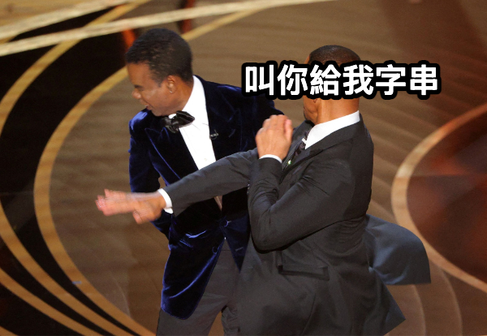
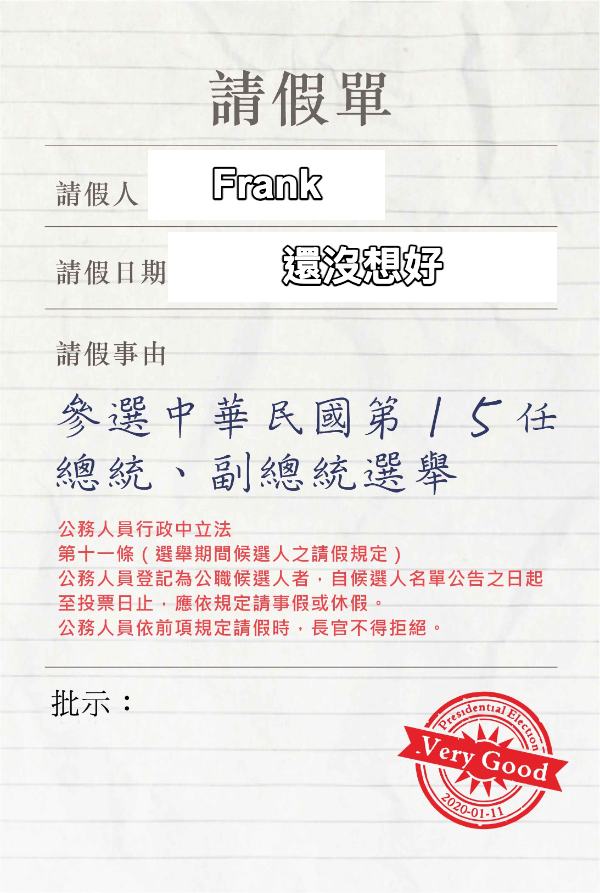

<!--
今天是我們 vue 課程的最後一堂

所以今天的範例中我會加入一些時事

如果說今天提到的故事跟時事有關的話

那就是真的有關
-->

---

<h1 class="font-bold text-center tracking-wide">
  一、元件狀態傳遞與事件
</h1>

<div class="text-center text-2xl">
  <code text-green>Props</code>、<code text-green>Emits</code>
</div>

<!--
今天我們第一個部份要介紹的是 Vue 裡面關於元件間資料傳遞的方式

這兩個方式分別是 Props 和 Emits

分別對應到父元件傳給子元件的資料，以及子元件傳給父元件的事件

現在聽起來可能會覺得有點抽象

但沒關係，因為等等的虛構故事聽完應該會比較清楚
-->

---

<h2
  transition duration-400
  class="font-bold text-center tracking-wider"
  :class="$clicks > 1 ? '-translate-y-12' : '-translate-y-6'"
>
  什麼是 <span v-mark.green>Props</span> ?
</h2>

<div
  transition duration-400
  class="text-3xl text-center flex justify-center items-center gap-x-4"
  :class="$clicks > 1 ? '-translate-y-3 op100' : '-translate-y-6 op0'"
  v-click
>
  <div class="px-4 py-2 font-bold bg-green/10 border-2 border-green/30 rounded-lg">
    父元件
  </div>
  <div class="text-3xl flex items-center justify-center gap-x-2">
    <div
      i-heroicons:arrow-long-right-20-solid
      class="animate-flash"
      style="animation-iteration-count: infinite; animation-duration: 2.5s; animation-timing-function: ease-in-out;"
    ></div>
    <span>傳遞</span>
    <div
      i-heroicons:arrow-long-right-20-solid
      class="animate-flash"
      style="animation-iteration-count: infinite; animation-duration: 2.5s; animation-timing-function: ease-in-out;"
    ></div>
  </div>
  <div class="px-4 py-2 font-bold bg-blue/10 border-2 border-blue/30 rounded-lg">
    子元件
  </div>
</div>

<div class="absolute left-1/2 bottom-30 -translate-x-1/2 text-center" v-click>
  <div class="text-2xl mb-2">小美買一台 <span text-yellow>Macbook Air</span> 給小明使用</div>
  <div class="text-lg op70">小明無法自己購買<span v-click="4" class="text-red">（車貸好貴）</span></div>
  <div class="text-lg op70">只能由小美購買後再給小明使用</div>
</div>

<!--
首先我們先從 Props 開始介紹

[click] 到底什麼是 Props 呢

[click] 在 Vue 的資料傳遞過程中，如果父元件要傳遞資料或響應式狀態給子元件的話，父元件就需要使用 Props 來將資料傳遞給子元件

[click] 舉個例子來說，今天小明工作上需要一台 Macbook Air 做為他的開發工具，但很可惜的是小明現在要繳車貸沒有錢，這時候小美就可憐他，所以小美就買了一台 Macbook Air 給小明使用

[click] 在這個例子中，小美就是父元件小明就是子元件，而 Macbook Air 就是 Props

所以我們也可以說小明元件中有一個 Props 叫做 gift，值是 Macbook Air
-->

---

<h2 class="font-bold tracking-wide">
  Props 的傳遞原則
</h2>

<!--
稍微瞭解 Props 的定義後

我們來看看 Props 在傳遞資料的過程中

有哪些原則是我們需知道或遵守的

-->

---

<div class="grid grid-cols-2 gap-8 mt-8">

<div v-click="1" class="p-6 bg-blue/10 border-2 border-blue/30 rounded-lg">
  <h3 class="flex items-center gap-x-2 font-bold mb-4">
    <span class="w-8 h-8 bg-blue rounded-full flex items-center justify-center text-white font-bold">1</span>
    <span>指定接收類型</span>
  </h3>
  <div class="text-lg">可以傳送固定的值（如文字"你好"）或會變動的資料（如使用者資訊）</div>
</div>

<div v-click="2" class="p-6 bg-green/10 border-2 border-green/30 rounded-lg">
  <h3 class="flex items-center gap-x-2 font-bold mb-4">
    <span class="w-8 h-8 bg-green rounded-full flex items-center justify-center text-white font-bold">2</span>
    <span>可選或必需</span>
  </h3>
  <div class="text-lg">有些 props 一定要有（必需），有些可有可無（可選）</div>
</div>

<div v-click="3" class="p-6 bg-yellow/10 border-2 border-yellow/30 rounded-lg">
  <h3 class="flex items-center gap-x-2 font-bold mb-4">
    <span class="w-8 h-8 bg-yellow rounded-full flex items-center justify-center text-black font-bold">3</span>
    <span>單向資料流</span>
  </h3>
  <div class="text-lg">就像瀑布一樣，水只能往下流，不能往上流</div>
</div>

<div v-click="4" class="p-6 bg-purple/10 border-2 border-purple/30 rounded-lg">
  <h3 class="flex items-center gap-x-2 font-bold mb-4">
    <span class="w-8 h-8 bg-purple rounded-full flex items-center justify-center text-white font-bold">4</span>
    <span>資料純淨</span>
  </h3>
  <div class="text-lg">子元件收到資料後，要保持原樣，不能隨意修改</div>
</div>

</div>

<!--
[click] 第一個是 Props 可以傳遞固定的值，也可以傳遞會變動的資料

[click] 第二個是 Props 可以設定某些資料是必需的，某些資料是可選的，這部份對於功能性的元件就很重要

[click] 第三個是使用 Props 傳遞資料時要注意資料傳遞的方向是單向的，就像瀑布一樣，水只能往下流，不能往上流

[click] 第四個是 Props 的資料純淨，子元件收到資料後，要保持原樣，不能隨意修改

以上這四個原則在我們後面的範例中會有更詳細的介紹
-->

---

<div class="flex justify-between items-center gap-x-2">
<h2 class="font-bold tracking-wide">
  Props 基本範例
</h2>

<PlaygroundLink category="day3" link="PropsBasic">Playground</PlaygroundLink>

</div>

<div class="text-lg mb-6 mt-3">
  延續剛剛的例子，假設小美今天從 A13 的 Apple 直營店買了一台 Macbook Air...
</div>

<div class="grid grid-cols-2 gap-4">

<div v-click="1">
<div class="text-xl mb-2 font-bold">父元件 (NiceTzuYing.vue)</div>

```vue
<script setup>
import { ref } from 'vue'

const gift = ref('Macbook Air')
</script>

<template>
  <PoorFrank :gift="gift" />
</template>
```

</div>

<div v-click="2">
<div class="text-xl mb-2 font-bold">子元件 (PoorFrank.vue)</div>

```vue
<script setup>
const props = defineProps({
  gift: String,
})
</script>

<template>
  <div>
    <h1>我收到了 {{ gift }} 了</h1>
  </div>
</template>
```

</div>

</div>

<!--
我們可以延續剛剛的例子，假設小美今天從 A13 的 Apple 直營店買了一台 Macbook Air，然後交給 Frank，這時候 Frank 就可以使用 Macbook Air 去打楓之谷了

[click] 所以程式碼小美的程式碼部份就會像這樣

[click] 而可憐的 Frank 的程式碼部份就會像這樣

我們也可以點擊 playground 來看看實際的運作結果
-->

---

<h2 class="font-bold tracking-wide">
  Props 的命名規範
</h2>

<div class="bg-yellow/10 border-2 border-yellow/30 rounded-lg p-6 mb-6 mt-6">
  <div class="text-lg font-bold mb-2">重要提醒</div>
  <div class="text-base">
    Props 在命名的部份對於父、子元件來說，有兩種不同的命名規範：
  </div>
  <div class="mt-2 grid grid-cols-2 gap-4">
    <div class="bg-white/20 p-3 rounded">
      <div class="font-bold">父元件</div>
      <div class="text-sm">使用烤肉串命名法 (kebab-case)</div>
      <div class="text-sm">例如：<code>user-name</code>、<code>is-admin</code>、<code>max-login-attempts</code></div>
    </div>
    <div class="bg-white/20 p-3 rounded">
      <div class="font-bold">子元件</div>
      <div class="text-sm">使用小駝峰命名法 (camelCase)</div>
      <div class="text-sm">例如：<code>userName</code>、<code>isAdmin</code>、<code>maxLoginAttempts</code></div>
    </div>
  </div>
</div>

<div class="text-lg mb-4">
  <span class="font-bold"  v-click="1">生活中的例子：</span>
  <div>
  <span v-click="1">就像我們寄東西，如果從上海寄一包豬肉乾到臺灣...</span>
  <span v-click="1" delay="2000" class="text-red">（⚠️ 這是違法的，請不要嘗試）</span>
  </div>
</div>

<div class="grid grid-cols-3 gap-4 text-center" v-click="1" delay="500">
  <div class="bg-blue/10 border border-blue/30 rounded-lg p-4">
    <div class="font-bold mb-2">中文地址</div>
    <div class="text-sm">台灣台北市信義區</div>
  </div>
  <div class="bg-green/10 border border-green/30 rounded-lg p-4">
    <div class="font-bold mb-2">英文地址</div>
    <div class="text-sm">Xinyi District, Taipei City, Taiwan</div>
  </div>
  <div class="bg-purple/10 border border-purple/30 rounded-lg p-4">
    <div class="font-bold mb-2">同一個地方</div>
    <div class="text-sm">對 Vue 來說，都是同一個 props 屬性</div>
  </div>
</div>

<!--
再來跟各位介紹一下關於 Props 的命名方式

這部份可能要稍微熟悉一下

因為就連我現在偶爾還是會寫錯

當我們今天要在父元件中傳遞資料給子元件的時候

Props 會用烤肉串的方式傳給子元件

而子元件在接收資料的時候

會用小駝峰的方式來接收

就以 userName 來說

父元件中會使用 - 來連接 user 跟 name

而子元件中會使用小駝峰來接收 userName

為什麼可以這樣呢，我們來舉個例子

[click] 就像我們寄東西，如果從上海寄一包豬肉乾到臺灣，因為是國際郵件，所以地址的部份我們寫中、英文混用

但不管中文英文，對於臺灣偉大貢獻的郵差來說，反正他都知道是要送到哪裡

Vue 也是一樣，只要父、子元件有遵守這個規則，就可以正常傳遞資料
-->

---

<div class="flex justify-between items-center gap-x-2 mb-2">
<h2 class="font-bold tracking-wide">
  命名規範範例
</h2>

<PlaygroundLink category="day3" link="PropsNameRules">Playground</PlaygroundLink>

</div>

<div class="grid grid-cols-2 gap-4 mt-6">

<div v-click="1">
<div class="text-xl mb-2 font-bold">父元件中使用烤肉串寫法</div>

```vue
<script setup>
import { ref } from 'vue'

const userName = ref('小明')
const isAdmin = ref(true)
const maxAttempts = ref(3)
</script>

<template>
  <UserCard
    :user-name="userName"
    :is-admin="isAdmin"
    :max-login-attempts="maxAttempts"
  />
</template>
```

</div>

<div v-click="2">
<div class="text-xl mb-2 font-bold">子元件中使用小駝峰寫法</div>

```vue
<script setup>
const props = defineProps({
  userName: String,
  isAdmin: Boolean,
  maxLoginAttempts: Number,
})
</script>

<template>
  <div>
    <h1>使用者名稱：{{ userName }}</h1>
    <p>是否為管理員：{{ isAdmin }}</p>
    <p>最大登入次數：{{ maxLoginAttempts }}</p>
  </div>
</template>
```

</div>

</div>

<!--
接著我們來看看實際的例子

[click] 在父元件中，我們宣告了三個響應式狀態，然後在模板中使用烤肉串命名法來傳遞 props

[click] 在子元件中，我們使用 defineProps 來定義接收的 props，使用小駝峰命名法，然後在模板中使用這些 props

我們也可以點擊 playground 來看看實際的運作結果
-->

---

<h2
  transition duration-400
  class="font-bold text-center tracking-wider"
  :class="$clicks > 1 ? '-translate-y-12' : '-translate-y-6'"
>
  靜態與動態的 Props
</h2>

<div
  transition duration-400
  class="text-center text-xl mb-8"
  :class="$clicks >= 1 ? '-translate-y-3 op100' : '-translate-y-6 op0'"
  v-click="1"
>
  在 Props 的傳遞過程中，可以分為靜態與動態的 Props
</div>

<div class="grid grid-cols-2 gap-8 mt-8" v-click="1" delay="700">

<div class="bg-blue/10 border-2 border-blue/30 rounded-lg p-6">
  <h3 class="font-bold text-xl mb-4 text-center">固定價格商品</h3>
  <div class="text-center mb-4">
    <div class="text-4xl mb-2">💧</div>
    <div class="text-lg">一瓶礦泉水</div>
    <div class="text-2xl font-bold text-green">$20</div>
  </div>
  <div class="text-sm text-center bg-white/20 p-2 rounded">
    價格固定，不會變動
  </div>
</div>

<div class="bg-orange/10 border-2 border-orange/30 rounded-lg p-6">
  <h3 class="font-bold text-xl mb-4 text-center">變動價格商品</h3>
  <div class="text-center mb-4">
    <div class="text-4xl mb-2">⛽</div>
    <div class="text-lg">石油價格</div>
    <div class="text-2xl font-bold text-red">$???</div>
  </div>
  <div class="text-sm text-center bg-white/20 p-2 rounded">
    每天都會根據市場變化
  </div>
</div>

</div>

<!--
在 Props 的傳遞過程中

我們分別可以傳遞靜態與動態的資料

像是靜態寫死的文字

或者是 API 撈回來的動態資料

[click] 舉個例子來說，假設我們想要在酷碰上面買買一瓶水，水的價格通常不太會有浮動，這時候就能將礦泉水的資料以靜態方式傳遞

而如果我們今天想要買的是石油的原油，因為油價是會浮動的，這時候石油的資料就會以動態方式傳遞
-->

---

<div class="flex justify-between items-center gap-x-2 mb-2">
<h2 class="font-bold tracking-wide">
  靜態與動態 Props 範例
</h2>

<PlaygroundLink category="day3" link="PropsStaticDynamic">Playground</PlaygroundLink>

</div>

<div class="grid grid-cols-2 gap-4 mt-6">

<div v-click="1">
<div class="text-xl mb-2 font-bold">靜態 Props</div>

```vue
<script setup>
const message = ref({
  product: '礦泉水',
  price: 20,
})
</script>

<template>
  <ShoppingCart :product="message" />
</template>
```

<div class="bg-blue/10 border border-blue/30 rounded p-2 mt-2">
  <div class="text-sm">價格固定不變</div>
</div>

</div>

<div v-click="2">
<div class="text-xl mb-2 font-bold">動態 Props</div>

```vue
<script setup>
const message = ref({
  product: '石油',
  price: 100,
})

setInterval(() => {
  message.value.price = Math.random() * 100
}, 1000)
</script>

<template>
  <ShoppingCart :product="message" />
</template>
```

<div class="bg-orange/10 border border-orange/30 rounded p-2 mt-2">
  <div class="text-sm">價格每秒都在變化</div>
</div>

</div>

</div>

<!--
讓我們看實際的程式碼範例：

[click] 靜態 Props 的部份，沒有什麼特別的陷阱，單純傳遞靜態的礦泉水資料

[click] 動態 Props 的部份，石油的價格會每秒鐘隨機變化，所以用了 setInterval 來模擬每秒石油價格的變化，同時因為石油的 data 是響應式狀態，所以當石油的價格變化時，子元件也會自動更新

我們可以點擊 playground 來看看實際的運作結果
-->

---

<h2
  class="font-bold tracking-wide duration-400 text-center"
  :class="$clicks > 0 ? '-translate-y-0' : 'translate-y-[170px]'"
>
  Props 如何設定可以接受的資料類型
</h2>

<div class="text-lg mt-6" v-click="1" delay="300">
  想像你正坐在飛往奧捷的飛機上，入境前你需要先把入境表填寫好...
</div>


<!--
剛剛有提到

我們可以透過 Props 的 type 來指定子元件可以接受的資料類型

當父元件傳遞的值不是子元件可以接受的資料類型時，Vue 會發出警告

[click] 這種檢查的機制，你可以想像成你正坐在飛往奧捷的飛機上，時間已經來到奧地利時間的 10/15 早上 6 點距離降落還有一個小時，這時候空姐說入境前你需要先把入境表填寫好，這時候每一個欄位都有不同的規定，不要亂寫
-->

---

<div class="grid grid-cols-2 gap-4 w-[800px]">

<div v-click="1">
<div class="text-xl mb-2 font-bold">入境表欄位規定</div>

<div class="space-y-3">
  <div class="bg-blue/10 border border-blue/30 rounded p-3">
    <div class="font-bold">姓名欄位</div>
    <div class="text-sm">只能寫英文，如 happy、lucky</div>
  </div>
  <div class="bg-green/10 border border-green/30 rounded p-3">
    <div class="font-bold">年齡欄位</div>
    <div class="text-sm">只能填數字，如 25、30</div>
  </div>
  <div class="bg-yellow/10 border border-yellow/30 rounded p-3">
    <div class="font-bold">婚姻狀況</div>
    <div class="text-sm">只能選擇「是」或「否」</div>
  </div>
  <div class="bg-purple/10 border border-purple/30 rounded p-3">
    <div class="font-bold">隨身物品</div>
    <div class="text-sm">可以勾選多個選項</div>
  </div>
  <div class="bg-orange/10 border border-orange/30 rounded p-3">
    <div class="font-bold">住宿地址</div>
    <div class="text-sm">包含飯店名稱、地址、電話</div>
  </div>
</div>

</div>

<div v-click="2">
<div class="text-xl mb-2 font-bold">程式中的對應類型</div>

<div class="space-y-3">
  <div class="bg-blue/10 border border-blue/30 rounded p-3">
    <div class="font-bold">String</div>
    <div class="text-sm">姓名欄位 - 文字資料</div>
  </div>
  <div class="bg-green/10 border border-green/30 rounded p-3">
    <div class="font-bold">Number</div>
    <div class="text-sm">年齡欄位 - 數值資料</div>
  </div>
  <div class="bg-yellow/10 border border-yellow/30 rounded p-3">
    <div class="font-bold">Boolean</div>
    <div class="text-sm">婚姻狀況 - 是/否選擇</div>
  </div>
  <div class="bg-purple/10 border border-purple/30 rounded p-3">
    <div class="font-bold">Array</div>
    <div class="text-sm">隨身物品 - 包含多個項目的陣列</div>
  </div>
  <div class="bg-orange/10 border border-orange/30 rounded p-3">
    <div class="font-bold">Object</div>
    <div class="text-sm">住宿地址 - 包含多種資訊的物件</div>
  </div>
</div>

</div>

</div>

<!--
[click] 這時候入境表上面就會有幾種不同的欄位，例如：只能寫英文的姓名、只能寫阿拉伯數字的年齡或者勾選隨身攜帶的物品

如果這時候，我就想宣揚中文的博大精深，姓名我就寫中文法蘭克，年齡我就寫大寫數字，可不可以呢？

當然可以，只是你很快就會飛回桃園了

[click] 那剛剛提到的表單中的欄位，其實也可以對應到 Props 的類型設定，例如

- 姓名欄位 = 只能寫英文，所以代表的就是字串 (String)
- 年齡欄位 = 只能填數字，所以代表的就是數字 (Number)
- 婚姻狀況 = 只能選擇「是」或「否」，所以代表的就是布林值 (Boolean)
- 隨身物品 = 可以勾選多個選項，所以代表的就是陣列 (Array)
- 住宿地址 = 包含飯店名稱、地址、電話，所以代表的就是物件 (Object)
-->

---

<div class="flex justify-between items-center gap-x-2">
<h2 class="font-bold tracking-wide">
  Props 類型檢查範例
</h2>

<PlaygroundLink category="day3" link="PropsTypeCheck">Playground</PlaygroundLink>

</div>

<div class="grid grid-cols-2 gap-4 translate-y-[15px]">

<div v-click="1">
<div class="text-xl mb-2 font-bold">父元件</div>

```vue
<script setup>
import { ref } from 'vue'

const userName = ref('kevin')
const age = ref(18)
const isMarried = ref(false)
const personalItems = ref(['手機', '筆電', '相機', '20Kg 黃金'])
const hotelData = ref({
  hotel: '布拉格四季酒店',
  address: 'Veleslavínova 1098/2a, 110 00 Josefov, 捷克',
  phone: '+420-221-427-000',
  price: 26950,
})
</script>

<template>
  <ImmigrationForm
    :user-name="userName"
    :age="age"
    :is-married="isMarried"
    :personal-items="personalItems"
    :hotel-data="hotelData"
  />
</template>
```

</div>

<div v-click="2">
<div class="text-xl mb-2 font-bold">子元件 (ImmigrationForm.vue)</div>

```vue
<script setup>
const props = defineProps({
  userName: String,
  age: Number,
  isMarried: Boolean,
  personalItems: Array,
  hotelData: Object,
})
</script>

<template>
  <div>
    <h1>姓名：{{ userName }}</h1>
    <p>年齡：{{ age }}</p>
    <p>婚姻狀況：{{ isMarried }}</p>
    <p>隨身物品：{{ personalItems }}</p>
    <p>住宿地址：{{ hotelData }}</p>
  </div>
</template>
```

</div>

</div>

<!--
讓我們看一個實際的範例：

[click] 在父元件中，我們宣告了入境表會使用到的資料

[click] 在子元件中，我們使用 defineProps 來定義接收的 props，並指定每個 prop 的資料類型

這樣當父元件傳遞錯誤的資料類型時，Vue 就會發出警告，幫助我們除錯。

我們可以點擊 playground 來看看實際的運作結果
-->

---

<h2
  class="font-bold tracking-wide duration-400 text-center"
  :class="$clicks > 0 ? '-translate-y-0' : 'translate-y-[170px]'"
>
   Props 的預設值＆必填項目
</h2>

<div class="text-lg mt-6" v-click="1" delay="300">
  繼承一下剛剛的奧捷例子，下飛機前除了要填入境表，海關申報單也不能忘記寫
</div>



<!--
除了說 props 可以設定接受的資料類型外

我們也可以設定必傳或預設的 props

[click] 再回到剛剛那個開心的奧捷例子，我們入境的時候除了要寫入境表，還要額外填寫一張海關申報單，確認我們身上沒有攜帶超過 10 萬美元或者上海的豬肉乾
-->

---

<div class="flex justify-between items-center gap-x-2">
<h2 class="font-bold tracking-wide">
  Props 預設值＆必填項目範例
</h2>

<PlaygroundLink category="day3" link="PropsDefaultValue">Playground</PlaygroundLink>

</div>

<div class="grid grid-cols-2 gap-4 w-[800px] mt-6">

<div v-click="1">
<div class="text-xl mb-2 font-bold">海關申報單規定</div>

<div class="space-y-3">
  <div class="bg-red/10 border border-red/30 rounded p-3">
    <div class="font-bold flex items-center gap-2">
      <span class="text-red">*</span>
      <span>姓名</span>
    </div>
    <div class="text-sm">必填，不能為空</div>
  </div>
  <div class="bg-blue/10 border border-blue/30 rounded p-3">
    <div class="font-bold">年齡</div>
    <div class="text-sm">選填，沒有預設值</div>
  </div>
  <div class="bg-yellow/10 border border-yellow/30 rounded p-3">
    <div class="font-bold flex items-center gap-2">
      <span>婚姻狀況</span>
    </div>
    <div class="text-sm">選填，預設為「否」</div>
  </div>
  <div class="bg-purple/10 border border-purple/30 rounded p-3">
    <div class="font-bold flex items-center gap-2">
      <span>隨身物品</span>
    </div>
    <div class="text-sm">選填，預設攜帶大麻，送小房間檢查</div>
  </div>
</div>

</div>

<div v-click="2">
<div class="text-xl mb-2 font-bold">Props 設定範例</div>

```vue
<script setup>
const props = defineProps({
  userName: {
    type: String,
    required: true,
  },
  age: {
    type: Number,
    required: false,
  },
  isMarried: {
    type: Boolean,
    default: false,
  },
  personalItems: {
    type: Array,
    default: () => ['大麻'],
  },
})
</script>
```

</div>

</div>

<!--
在這張海關申報單中，可能會有幾種欄位

[click] 例如必填的姓名、選填的年齡、選填的婚姻狀況、或者沒確實勾選的隨身物品的話，海關就認定你有帶大麻，這時候就一定是去小房間脫衣服的

[click] 如果我們把海關申報單的這些欄位轉成 props 的話，寫法就會像是這樣

我們可以點擊 playground 來看看實際的運作結果
-->

---

<h1
  transition duration-400
  class="font-bold tracking-wide text-center"
  :class="$clicks > 0 ? '-translate-y-4' : 'translate-y-0'"
>
  額外補充－單向資料流
</h1>

<div class="text-center text-2xl text-purple mb-8" v-click="1" delay="300">
  <code>父元件 → 子元件</code>
</div>

<!--
最後補充一個剛剛提到的單向資料流

當 props 傳給子元件的時候，子元件是不能對 props 的資料做任何修改的

-->

---

<h2 class="font-bold tracking-wide">
  什麼是單向資料流
</h2>

<div class="text-lg mb-8 mt-6">
  想像一下如果今天在機場 Check-in 的時候，地勤人員跟 Tim 說今天座位被升等到商務艙...
</div>

<div class="grid grid-cols-3 gap-4">

<div v-click="1" class="bg-green/10 border-2 border-green/30 rounded-lg p-6 text-center flex flex-col justify-between">
  <div class="text-4xl mb-4">👨‍💼</div>
  <div class="font-bold text-lg mb-2">地勤人員</div>
  <div class="text-sm">擁有座位升等權限</div>
  <div class="text-sm">可以決定艙等</div>
  <div class="text-xs mt-2 bg-white/20 p-2 rounded">父元件的資料</div>
</div>

<div v-click="3" class="bg-purple/10 border-2 border-purple/30 rounded-lg p-6 text-center flex flex-col justify-between">
  <div class="text-4xl mb-4">👩‍✈️</div>
  <div class="font-bold text-lg mb-2">空姐</div>
  <div class="text-sm">可以傳遞乘客的意見給地勤人員</div>
  <div class="text-sm">但無法更改座位</div>
  <div class="text-xs mt-2 bg-white/20 p-2 rounded">emit 事件</div>
</div>

<div v-click="2" class="bg-blue/10 border-2 border-blue/30 rounded-lg p-6 text-center flex flex-col justify-between">
  <div class="text-4xl mb-4">🧑‍💼</div>
  <div class="font-bold text-lg mb-2">大愛的 Tim</div>
  <div class="text-sm">只能接受地勤人員的決定</div>
  <div class="text-sm">不能擅自更改座位</div>
  <div class="text-xs mt-2 bg-white/20 p-2 rounded">接收資料的子元件</div>
</div>

</div>

<!--
想像一下如果今天在機場 Check-in 的時候

地勤人員跟 Tim 說今天座位被升等到商務艙

在這個情況下，Tim 登機的時候應該是要坐經濟艙的

如果一定要坐經濟艙的話

就要透過空姐通知地勤更改座位

[click] 這時候的地勤人員我們就可以想像成父元件

[click] 願意把商務艙讓出來的 Tim 就是接收資料的子元件

[click] 空姐打電話給地勤人員的過程就是發起 emit 事件
-->

---

<div class="flex justify-between items-center gap-x-2 mb-2">

<h2 class="font-bold tracking-wide">
  錯誤示範 - 直接修改 Props｜堅持要做經濟艙
</h2>

<PlaygroundLink category="day3" link="PropsErrorDemo">Playground</PlaygroundLink>

</div>

<div class="grid grid-cols-2 gap-4 translate-y-[12px]">

<div v-click="1">
<div class="text-xl mb-2 font-bold">父元件 (櫃臺.vue)</div>

```vue
<script setup>
const seatClass = ref('商務艙')
</script>

<template>
  <TimSeat :seat-class="seatClass" />
</template>
```

</div>

<div v-click="2">
<div class="text-xl mb-2 font-bold">子元件 (TimSeat.vue) - 錯誤做法</div>

```vue
<script setup>
const props = defineProps({
  seatClass: String,
})

function changeClass() {
  props.seatClass = '經濟艙' // ❌ 這樣會出錯！
}
</script>

<template>
  <div>
    <h1>座位：{{ seatClass }}</h1>
    <button @click="changeClass">
      堅持坐經濟艙
    </button>
  </div>
</template>
```

</div>

</div>

<div class="bg-yellow/10 border-2 border-yellow/30 rounded-lg p-4 mt-4" v-click="3">
  <div class="font-bold text-yellow mb-2">Vue 警告訊息：</div>
  <div class="text-sm font-mono bg-black/20 p-2 rounded">
    [Vue warn]: Attempting to mutate prop "seatClass". Props are readonly.
  </div>
</div>

<!--
雖然我沒遇過有商務艙不坐的情況

假設今天 Tim 就是要坐經濟艙的話會發生什麼事呢

但我想航警應該會上來關切一下

回到程式碼的部份

[click] 假設父元件也就是櫃臺，設定了 Tim 的艙等為「商務艙」

[click] 子元件也就是 Tim 試圖直接修改 props 的值

[click] Vue 會發出警告，告訴我們 Props 是只讀的，不能直接修改

這就是單向資料流的重要概念，確保資料的流向是可預測的。

至於事實是不是這樣，我們來實際玩玩看
-->

---

<h2 class="font-bold tracking-wide">
  單向資料流的優點
</h2>

<div class="grid grid-cols-1 gap-y-6 mt-8">

<div v-click="1" class="p-6 bg-green/10 border-2 border-green/30 rounded-lg">
  <h3 class="flex items-center gap-x-2 font-bold mb-4">
    <span class="w-8 h-8 bg-green rounded-full flex items-center justify-center text-white font-bold">1</span>
    <span>可預測性</span>
  </h3>
  <div class="text-lg">數據變化的源頭明確，容易追蹤和調試</div>
</div>

<div v-click="2" class="p-6 bg-blue/10 border-2 border-blue/30 rounded-lg">
  <h3 class="flex items-center gap-x-2 font-bold mb-4">
    <span class="w-8 h-8 bg-blue rounded-full flex items-center justify-center text-white font-bold">2</span>
    <span>維護性</span>
  </h3>
  <div class="text-lg">避免了數據變化的混亂，降低了維護成本</div>
</div>

<div v-click="3" class="p-6 bg-purple/10 border-2 border-purple/30 rounded-lg">
  <h3 class="flex items-center gap-x-2 font-bold mb-4">
    <span class="w-8 h-8 bg-purple rounded-full flex items-center justify-center text-white font-bold">3</span>
    <span>測試性</span>
  </h3>
  <div class="text-lg">元件的資料傳遞過程更容易預測，如果有要寫單元測試的話，也會比較容易</div>
</div>

</div>

<!--
單向資料流是指數據只能從父元件流向子元件，子元件不能直接修改從父元件接收到的 props。這種設計有以下優點：

[click] 1. 可預測性: 數據變化的源頭明確，容易追蹤和調試，例如 Tim 本來就預定商務艙，但櫃臺說只有經濟艙了，這時候 Tim 就會知道是櫃臺的問題

[click] 2. 維護性: 避免了數據變化的混亂，降低了維護成本，例如 Tim 的座位被改成經濟艙，這時候只要去櫃臺就可以知道是誰改的

[click] 3. 測試性: 如果有要寫單元測試的話，因為資料的流向是可預測的，所以比較容易針對各種情境去寫測試
-->

---

<h1 class="font-bold tracking-wide text-center">
  Props 總結
</h1>

<div class="text-center text-2xl mt-8 space-y-4">
  <div v-click="1" class="flex items-center justify-center gap-4">
    <div class="px-4 py-2 bg-green/10 border border-green/30 rounded">父元件</div>
    <div>→</div>
    <div class="px-4 py-2 bg-blue/10 border border-blue/30 rounded">子元件</div>
  </div>
  <div v-click="2" class="text-lg">
    <code>defineProps</code> 讓子元件接收父元件的資料
  </div>
  <div v-click="3" class="text-lg">
    遵循單向資料流原則，確保應用程式的可預測性
  </div>
</div>

<!--
我們已經學會了：

[click] Props 讓父元件可以向子元件傳遞資料

[click] 使用 defineProps 來定義子元件接收的資料，以及設定資料的類型、預設值、必填等

[click] 遵循單向資料流原則，確保資料的可預測性
-->

---

<h2
  transition duration-400
  class="font-bold text-center tracking-wider"
  :class="$clicks > 1 ? '-translate-y-12' : '-translate-y-6'"
>
  什麼是 <span v-mark.orange>Emits</span> ?
</h2>

<div
  transition duration-400
  class="text-3xl text-center flex justify-center items-center gap-x-4"
  :class="$clicks > 1 ? '-translate-y-3 op100' : '-translate-y-6 op0'"
  v-click
>
  <div class="px-4 py-2 font-bold bg-blue/10 border-2 border-blue/30 rounded-lg">
    子元件
  </div>
  <div class="text-3xl flex items-center justify-center gap-x-2">
    <div
      i-heroicons:arrow-long-right-20-solid
      class="animate-flash"
      style="animation-iteration-count: infinite; animation-duration: 2.5s; animation-timing-function: ease-in-out;"
    ></div>
    <span>報告</span>
    <div
      i-heroicons:arrow-long-right-20-solid
      class="animate-flash"
      style="animation-iteration-count: infinite; animation-duration: 2.5s; animation-timing-function: ease-in-out;"
    ></div>
  </div>
  <div class="px-4 py-2 font-bold bg-green/10 border-2 border-green/30 rounded-lg">
    父元件
  </div>
</div>

<div class="absolute left-1/2 bottom-40 -translate-x-1/2 text-center" v-click>
  <div class="text-2xl mb-2">就像 <span text-orange>小孩向父母報告消息</span></div>
  <div class="text-lg op70">小孩遇到什麼事情，需要告知父母並請求幫助</div>
</div>

<!--
那什麼是 Emits 呢？

剛才有提到 props 是不能被修改的

那如果今天的情境就真的想做經濟艙的話要怎麼辦

很簡單，把座位的名字寫上 Frank 就好

實際上會使用到 Emits 來達成

[click]

[click] Emits 是 Vue 中用於子元件向父元件傳遞資料變更事件的機制，如果遇到子元件有資料變更的話，依照單向資料流的規定，我們就會需要使用 Emits 事件來將變更的資料內容傳遞給父元件。

[click] 舉個例子來說，Emits 就像是孩子向父母報告消息，小孩遇到什麼事情，需要告知父母並請求幫助。

這樣就能在維持單向資料流的同時，讓子元件影響父元件的狀態。
-->

---

<h2
  class="font-bold tracking-wide duration-400 text-center"
  :class="$clicks > 0 ? '-translate-y-0' : 'translate-y-[170px]'"
>
   Emits 的傳遞原則
</h2>

<div class="text-lg mt-6" v-click="1" delay="300">
  例如金管大會中，美妃說今年公司業績不錯發給大家獎金 20 萬，這時候皓澤就舉手說...
</div>


<!--
  相較於 Props

  emits 發送事件的原則就簡單多了

  一樣我們一起想像一下

  [click]例如金管大會中，美妃說今年公司業績不錯發給大家獎金 20 萬，這時候皓澤就舉手告訴美妃，20 萬不夠，請美妃再給大家 10 萬，美妃聽到後就思考了一下，最後就把獎金提高到 30 萬。
 -->

---

<div class="grid grid-cols-2 gap-4 mt-8">

<div v-click="1" class="p-6 bg-blue/10 border-2 border-blue/30 rounded-lg">
  <h3 class="flex items-center gap-x-2 font-bold mb-4">
    <span class="w-8 h-8 bg-blue rounded-full flex items-center justify-center text-white font-bold">1</span>
    <span>向上傳遞</span>
  </h3>
  <div class="text-lg">與 Props 相反，從子元件傳給父元件</div>
</div>

<div v-click="2" class="p-6 bg-green/10 border-2 border-green/30 rounded-lg">
  <h3 class="flex items-center gap-x-2 font-bold mb-4">
    <span class="w-8 h-8 bg-green rounded-full flex items-center justify-center text-white font-bold">2</span>
    <span>父元件監聽</span>
  </h3>
  <div class="text-lg">父元件需要「監聽」子元件的 Emits 事件</div>
</div>

<div v-click="3" class="p-6 bg-yellow/10 border-2 border-yellow/30 rounded-lg">
  <h3 class="flex items-center gap-x-2 font-bold mb-4">
    <span class="w-8 h-8 bg-yellow rounded-full flex items-center justify-center text-black font-bold">3</span>
    <span>可以傳資料</span>
  </h3>
  <div class="text-lg">不只是通知，還可以帶上詳細資訊</div>
</div>

<div v-click="4" class="p-6 bg-purple/10 border-2 border-purple/30 rounded-lg">
  <h3 class="flex items-center gap-x-2 font-bold mb-4">
    <span class="w-8 h-8 bg-purple rounded-full flex items-center justify-center text-white font-bold">4</span>
    <span>事件驗證</span>
  </h3>
  <div class="text-lg">可以檢查傳遞的資料是否正確</div>
</div>

</div>

<!--

[click] 向上傳遞：與 Props 相反，從子元件傳給父元件，就像皓澤舉手告訴美妃要再加 10 萬

[click] 父元件監聽：父元件要「聽」子元件的訊息，就像美妃要注意皓澤舉手

[click] 可以傳資料：不只是通知，還可以帶上詳細資訊，就像皓澤舉手告訴美妃要再加 10 萬，原因是因為大家都很努力

[click] 事件驗證：可以檢查傳遞的資料是否正確，就像美妃要檢查皓澤的舉手後提的要求是否合理
-->

---

<h2 class="font-bold tracking-wide">
  Emits 的命名規則
</h2>

<div class="bg-yellow/10 border-2 border-yellow/30 rounded-lg p-6 mt-4">
  <div class="text-lg font-bold mb-2">重要提醒</div>
  <div class="text-base">
    在 Vue 中，Emits 事件的命名規則都是使用烤肉串命名法，例如：<code>button-click</code>、<code>form-submit</code>
  </div>
</div>

<div class="grid grid-cols-1 gap-y-4 mt-4">

<div v-click="1" class="bg-blue/10 border border-blue/30 rounded-lg p-4">
  <div class="font-bold mb-2">父元件監聽子元件的 Emits 事件</div>
  <div class="text-sm"><code>@event-name='handleEvent'</code></div>
</div>

<div v-click="2" class="bg-green/10 border border-green/30 rounded-lg p-4">
  <div class="font-bold mb-2">子元件宣告 Emits 事件</div>
  <div class="text-sm"><code>const emit = defineEmits(['event-name'])</code></div>
</div>

<div v-click="3" class="bg-purple/10 border border-purple/30 rounded-lg p-4">
  <div class="font-bold mb-2">子元件發出 Emits 事件</div>
  <div class="text-sm"><code>emit('event-name', data)</code></div>
</div>

</div>

<!--
在 Vue 中，Emits 事件的命名規則相對統一

都是使用烤肉串命名法，例如：button-click、form-submit

[click] 實際在父元件監聽 Emits 事件的話就會這樣寫：@event-name='handleEvent'

[click] 子元件宣告 Emits 事件的話就會這樣寫：const emit = defineEmits(['event-name'])

[click] 子元件發出 Emits 事件的話就會這樣寫：emit('event-name', data)
-->

---

<div class="flex justify-between items-center gap-x-2 mb-2">

<h2 class="font-bold tracking-wide">
  Emits 基本範例
</h2>

<PlaygroundLink category="day3" link="EmitsBasic">Playground</PlaygroundLink>

</div>

<div class="grid grid-cols-2 gap-4">

<div v-click="1">
<div class="text-xl mb-2 font-bold">父元件 (美妃.vue)</div>

```vue
<script setup>
import { ref } from 'vue'

const bonus = ref(200000)
function updateBonus(newBonus) {
  setTimeout(() => {
    logMessage.value.push('美妃決定要加 10 萬')
    bonus.value = newBonus + 100000
  }, 1000)
}
</script>

<template>
  <div>
    <EveryoneBonus
      :bonus="bonus"
      @we-want-more-bonus="updateBonus"
    />
  </div>
</template>
```

</div>

<div v-click="2">
<div class="text-xl mb-2 font-bold">子元件 (皓澤.vue)</div>

```vue
<script setup>
const props = defineProps({
  bonus: Number,
})

const emit = defineEmits(['we-want-more-bonus'])

function handleUpdate(newBonus) {
  emit('we-want-more-bonus', newBonus)
}
</script>

<template>
  <div>
    <h1>獎金: {{ bonus }}</h1>
    <button @click="handleUpdate(300000)">
      +10 萬
    </button>
  </div>
</template>
```

</div>

</div>

<!--
我們可以延續剛剛的例子，一樣是金管大會的情境：

[click] 在父元件（美妃）中，設定獎金狀態為 20 萬，同時監聽子元件的 we-want-more-bonus 事件，看看有沒有人會提出問題

[click] 在子元件（皓澤）中，接收獎金 Props，並在按鈕點擊時發出 Emits 事件，表示想要加薪 10 萬

這時候我們就應該感謝皓澤的付出
-->

---

<h2 class="font-bold tracking-wide">
  Emits 的宣告方式
</h2>

<div class="text-lg mt-6 mb-8">
  在 Vue 中，我們有兩種主要的方式來宣告 Emits 事件
</div>

<div class="grid grid-cols-2 gap-6">

<div v-click="1" class="bg-blue/10 border-2 border-blue/30 rounded-lg p-6">
  <h3 class="font-bold text-xl mb-4 text-center">陣列語法</h3>
  <div class="text-center mb-4">
    <div class="text-4xl mb-2">📋</div>
    <div class="text-lg">簡單直接的方式</div>
  </div>
  <div class="text-sm text-center bg-white/20 p-2 rounded">
    最常用的宣告方式
  </div>
</div>

<div v-click="2" class="bg-green/10 border-2 border-green/30 rounded-lg p-6">
  <h3 class="font-bold text-xl mb-4 text-center">物件語法</h3>
  <div class="text-center mb-4">
    <div class="text-4xl mb-2">🔍</div>
    <div class="text-lg">可以加入驗證規則</div>
  </div>
  <div class="text-sm text-center bg-white/20 p-2 rounded">
    更嚴格的資料檢查
  </div>
</div>

</div>

<!--
在 Vue 中，我們有兩種主要的方式來宣告 Emits 事件

[click] 第一種是陣列語法，這是最簡單常用的方式，就是在 defineEmits 中使用陣列並寫上 emits 事件的名稱來宣告

[click] 第二種是物件語法，可以加入驗證規則，當我們發出 Emits 事件時，子元件可以在發送前檢查資料是否符合規則
-->

---

<h2 class="font-bold tracking-wide">
  陣列語法
</h2>

<div class="text-lg mt-6 mb-8">
  最簡單常用的方式，就是在 defineEmits 中使用字串陣列來宣告 Emits 事件
</div>

<div class="bg-blue/10 border-2 border-blue/30 rounded-lg p-6">
  <div class="text-xl font-bold mb-4 text-center">範例程式碼</div>

```vue
<script setup>
const emit = defineEmits(['we-want-more-bonus'])
</script>
```

<div class="text-sm mt-4 bg-white/20 p-3 rounded">
  <div class="font-bold mb-2">說明：</div>
  <div>宣告一個名為 'we-want-more-bonus' 的 Emits 事件，子元件可以發出這個事件來通知父元件</div>
</div>

</div>

<!--
剛剛皓澤的舉手情境

用的就是陣列的語法

直接在 defineEmits 中傳入一個字串陣列

-->

---

<h2
  class="font-bold tracking-wide duration-400 text-center"
  :class="$clicks > 0 ? '-translate-y-0' : 'translate-y-[170px]'"
>
    物件語法－驗證規則
</h2>

<div class="text-lg mt-6" v-click="1" delay="300">
  Frank 想要請假，但公司規定特定類型的假，需要不同的證明...
</div>



<!--
當我們發出 Emits 事件時，可以傳遞資料給父元件，子元件可以在發送前檢查資料是否符合規則

[click] 例如 Frank 想要請假，但按照公司規定特定類型的假，需要提供不同的證明才能准假

像這種情境的話，emits 的驗證規則我們就可以這樣寫
 -->

---

<div class="flex justify-between items-center gap-x-2 mb-2">
<h2 class="font-bold tracking-wide">
  物件語法驗證規則範例
</h2>

<PlaygroundLink category="day3" link="EmitsObjectVerify">Playground</PlaygroundLink>

</div>

<div class="grid grid-cols-2 gap-4 mt-6">

<div v-click="1">
<div class="text-xl mb-2 font-bold">父元件 (小美.vue)</div>

```vue
<script setup>
function handleAnnualLeave() {
  console.log('Frank 申請特休 - 核准（應該是這樣XD）')
}

function handleSickLeave(receipt) {
  console.log(`Frank 申請病假 - 收據：${receipt} - 核准`)
}
</script>

<template>
  <div>
    <Frank
      @annual-leave="handleAnnualLeave"
      @sick-leave="handleSickLeave"
    />
  </div>
</template>
```

</div>

<div v-click="2">
<div class="text-xl mb-2 font-bold">子元件 (Frank.vue)</div>

```vue
<script setup>
const emit = defineEmits({
  'annual-leave': null,

  'sick-leave': (receipt, date) => {
    // 收據不能為空
    if (!receipt || typeof receipt !== 'string' || receipt.length === 0) {
      return false
    }
    return true
  },
})

function handleAnnualLeave() {
  emit('annual-leave')
}

function handleSickLeave(receipt, date) {
  emit('sick-leave', receipt, date)
}
</script>
```

</div>

</div>

<!--
讓我們來看看實際的程式碼範例：

[click] 在父元件（小美）中，我們監聽 Frank 的請假申請事件，包含特休和病假

[click] 在子元件（Frank）中，我們使用物件語法來定義 Emits 事件，其中特休不需要驗證，直接設為 null，而病假需要驗證收據和日期格式

當驗證失敗時，Vue 會在開發環境中顯示警告訊息
-->

---

<h2
  class="font-bold tracking-wide duration-400 text-center"
  :class="$clicks > 0 ? '-translate-y-0' : 'translate-y-[170px]'"
>
    靜態與動態 Emits 範例
</h2>

<div class="text-lg mt-6" v-click="1" delay="300">
  畢業旅行的其中一個行程是去巴黎看聖母院，但沒想到...
</div>


<!--
在 Emits 的傳遞過程中，可以在事件中帶入資料，這個資料可以分為靜態與動態，像是固定的按鈕點擊事件，或是根據使用者行為動態產生的事件。

[click] 這種情況會發生在，例如大學的畢業旅行，一群人千里迢迢的從臺灣飛到巴黎想去實際看看心心念念的聖母院，但沒想到到巴黎的時候聖母院就著火了，當下只能隨機找一個替代的景點，這時候原本的固定行程就變成動態的事件觸發

 -->

---

<div class="flex justify-between items-center gap-x-2 mb-2">
<h2 class="font-bold tracking-wide">
  靜態與動態 Emits 範例
</h2>

<PlaygroundLink category="day3" link="EmitsStaticRandom">Playground</PlaygroundLink>

</div>

<div class="grid grid-cols-2 gap-4 mt-6">

<div v-click="1">
<div class="text-xl mb-2 font-bold">父元件 (TourManager.vue)</div>

```vue
<script setup>
import { ref } from 'vue'

const visitedPlace = ref('')

function handleVisitPlace(place) {
  visitedPlace.value = place
}

function handleFindAlternative(place) {
  visitedPlace.value = place
}
</script>

<template>
  <div>
    <div v-if="visitedPlace">
      參觀的景點：{{ visitedPlace }}
    </div>
    <TourGuide
      @visit-place="handleVisitPlace"
      @find-alternative="handleFindAlternative"
    />
  </div>
</template>
```

</div>

<div v-click="2">
<div class="text-xl mb-2 font-bold">子元件 (TourGuide.vue)</div>

```vue
<script setup>
const emit = defineEmits(['visit-place', 'find-alternative'])

const randomPlace = ['羅浮宮', '艾菲爾鐵塔', '塞納河遊船', '隨機景點']

function visitNotreDame() {
  emit('visit-place', '巴黎聖母院')
}

function findAlternative() {
  const randomIndex = Math.floor(Math.random() * randomPlace.length)
  emit('find-alternative', randomPlace[randomIndex])
}
</script>

<template>
  <div>
    <button @click="visitNotreDame">
      參觀巴黎聖母院
    </button>
    <button @click="findAlternative">
      隨機找替代景點
    </button>
  </div>
</template>
```

</div>

</div>

<!--
在剛剛的情境中

假設聖母院沒有失火

那當我們觸發 emits 事件的時候要參觀的景點就一定會是聖母院

但現在聖母院失火了，我們只能隨機找一個替代的景點

這時候原本的固定行程就變成動態的事件觸發

所以我們如果試著把這個情境轉換成程式碼的話

[click] 靜態事件就會像這樣

[click] 動態事件觸發的部份，會根據使用者輸入的內容長度，動態決定要發出什麼事件，可能是 'too-long'、'too-short' 或 'valid'

這樣就能根據不同的條件，發出不同的事件給父元件處理
-->

---

<h1 class="font-bold tracking-wide text-center">
  Emits 總結
</h1>

<div class="text-center text-2xl mt-8 space-y-4">
  <div v-click="1" class="flex items-center justify-center gap-4">
    <div class="px-4 py-2 bg-blue/10 border border-blue/30 rounded">子元件</div>
    <div>→</div>
    <div class="px-4 py-2 bg-green/10 border border-green/30 rounded">父元件</div>
  </div>
  <div v-click="2" class="text-lg">
    <code>defineEmits</code> 讓子元件向父元件發送事件
  </div>
  <div v-click="3" class="text-lg">
    搭配 Props 形成完整的父子元件通訊機制
  </div>
</div>

<!--
我們已經學會了：

[click] Emits 讓子元件可以向父元件發送事件

[click] 使用 defineEmits 來定義子元件可以發送的事件，並設定驗證規則

[click] 搭配 Props 形成完整的父子元件通訊機制
-->
