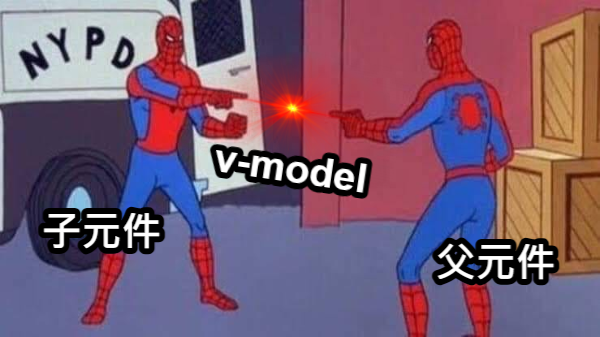

<div
  transition duration-400
  :class="$clicks > 0 ? '-translate-y-20' : 'translate-y-0'"
>
  <h1 class="font-bold text-center tracking-wide">
    二、元件的雙向綁定
  </h1>
  
  <div class="text-center text-2xl">
    <code text-purple>v-model</code>、<code text-green>defineModel</code>
  </div>
</div>

<div
  transition duration-400
  class="absolute left-1/2 top-1/2 -translate-x-1/2 translate-y-0 w-80 rounded overflow-hidden"
  :class="$clicks > 0 ? 'op100' : 'op0'"
  v-click
>
  
</div>

<!--
之前有提到對 `input` 各個類型，或是 `textarea` 多行文本、`select` 選擇器等等的表單元素會使用 `v-model` 進行雙向綁定。

不過有時候因為特殊的樣式、排版組合或是元件職責分離等情況，會需要把一些表單元素封裝成一個 Vue 元件。

而且如果是低層次的元件，也就是元件所包含的網頁元素愈少愈接近單一職責，通常會比較依賴外部傳遞狀態給它去渲染畫面，

[click] 但是要怎麼讓這個表單元素組成的元件，和外部元件 ( 也就是父元件 ) 進行狀態的雙向綁定呢 ?

可以先思考一下，如果我們需要父、子元件雙向綁定的話，前提是什麼 →
-->

---
transition: slide-left
---

<h2 class="text-2xl font-bold text-center tracking-wide">
  父、子元件 <span class="text-purple">雙向綁定</span> 核心概念
</h2>

<div class="grid grid-cols-2 gap-8 mt-8">
  <!-- 左邊卡片 - Prop -->
  <div class="relative bg-blue/20 rounded-lg pt-6 pb-4 border-2 border-blue-600/30">
    <div class="text-center mb-4">
      <h3 class="tracking-wide font-bold mb-4">狀態傳遞</h3>
      <div class="flex flex-col gap-y-6 items-center justify-center">
        <span class="bg-purple-300 text-purple-800 px-3 pb-1 pt-1.5 rounded-full text-xl font-bold">父元件</span>
        <div class="relative h-4">
          <div
            v-motion
            :initial="{ opacity: 0 }"
            :enter="{ opacity: 1, transition: { duration: 600, repeat: Infinity, repeatType: 'reverse', delay: -400 } }"
            class="absolute -top-4 -left-3"
          >
            <div i-material-symbols:arrow-back-ios-new-rounded class="-rotate-90 text-2xl text-purple-100 font-bold"></div>
          </div>
          <div
            v-motion
            :initial="{ opacity: 0 }"
            :enter="{ opacity: 1, transition: { duration: 600, repeat: Infinity, repeatType: 'reverse', delay: -200 } }"
            class="absolute -top-1 -left-3"
          >
            <div i-material-symbols:arrow-back-ios-new-rounded class="-rotate-90 text-2xl text-purple-200 font-bold"></div>
          </div>
          <div
            v-motion
            :initial="{ opacity: 0 }"
            :enter="{ opacity: 1, transition: { duration: 600, repeat: Infinity, repeatType: 'reverse' } }"
            class="absolute top-2 -left-3"
          >
            <div i-material-symbols:arrow-back-ios-new-rounded class="-rotate-90 text-2xl text-purple-300 font-bold"></div>
          </div>
        </div>
        <span class="bg-green-300 text-green-800 px-3 pb-1 pt-1.5 rounded-full text-xl font-bold">子元件</span>
      </div>
    </div>
    <div class="absolute top-1/2 left-1/2 -translate-x-1/2 -translate-y-1/2 text-center text-24 text-blue font-bold op-15 -z-10">
      Props
    </div>
  </div>

  <!-- 右邊卡片 - Emit -->
  <div class="relative bg-orange/20 rounded-lg pt-6 pb-4 border-2 border-orange-600/30">
    <div class="text-center mb-4">
      <h3 class="tracking-wide font-bold mb-4">事件通知</h3>
      <div class="flex flex-col gap-y-6 items-center justify-center">
        <span class="bg-purple-300 text-purple-800 px-3 pb-1 pt-1.5 rounded-full text-xl font-bold">父元件</span>
        <div class="relative h-4">
          <div
            v-motion
            :initial="{ opacity: 0 }"
            :enter="{ opacity: 1, transition: { duration: 600, repeat: Infinity, repeatType: 'reverse' } }"
            class="absolute -top-4 -left-3"
          >
            <div i-material-symbols:arrow-back-ios-new-rounded class="rotate-90 text-2xl text-green-300 font-bold"></div>
          </div>
          <div
            v-motion
            :initial="{ opacity: 0 }"
            :enter="{ opacity: 1, transition: { duration: 600, repeat: Infinity, repeatType: 'reverse', delay: -200 } }"
            class="absolute -top-1 -left-3"
          >
            <div i-material-symbols:arrow-back-ios-new-rounded class="rotate-90 text-2xl text-green-200 font-bold"></div>
          </div>
          <div
            v-motion
            :initial="{ opacity: 0 }"
            :enter="{ opacity: 1, transition: { duration: 600, repeat: Infinity, repeatType: 'reverse', delay: -400 } }"
            class="absolute top-2 -left-3"
          >
            <div i-material-symbols:arrow-back-ios-new-rounded class="rotate-90 text-2xl text-green-100 font-bold"></div>
          </div>
        </div>
        <span class="bg-green-300 text-green-800 px-3 pb-1 pt-1.5 rounded-full text-xl font-bold">子元件</span>
      </div>
    </div>
    <div class="absolute top-1/2 left-1/2 -translate-x-1/2 -translate-y-1/2 text-center text-24 text-orange font-bold op-15 -z-10">
      Emits
    </div>
  </div>
</div>

<div class="flex justify-around mt-4">
  <div class="w-60" v-click>
    
  </div>
  <div class="w-60" v-click>
    
  </div>
</div>

<!--
雙向綁定的核心概念，其實也是利用前面章節提到的 Props 狀態傳遞和 Emits 事件通知來達成的。

看到左邊卡片，**父元件** 使用 props 把狀態傳遞給 **子元件** ，當這個響應式狀態更新的時候，**子元件** 內的狀態也會同步更新，

[click] 這就像哆啦A夢把道具拿給大雄一樣，這樣就滿足第一個單向狀態綁定的條件，

再來看到右邊卡片，**子元件** 靠 emits 事件通知的方式呼叫 **父元件** 更新狀態，當 **父元件** 的狀態更新後，所傳遞到子元件的狀態也會跟著更新，

[click] 就像大雄被胖虎欺負，跑去找哆啦A夢拿道具。
-->

---
transition: slide-left
---

<div class="grid grid-rows-2 gap-4 w-75% mx-auto">
<div>
<div class="text-2xl font-bold">
  <code>App.vue</code>
</div>

<div>

```vue {*|3|8|none|3,8}{lines:true}
<script setup>
// ...
const message = ref('')
// ...
</script>

<template>
  <MyInput v-model="message" />
</template>
```

</div>
</div>

<div>
<div class="text-2xl font-bold">
  <code>MyInput.vue</code>
</div>

<div>

```vue {*|none|none|2-3|2-3}{lines:true,at:1}
<script setup>
defineProps(['modelValue'])
const emit = defineEmits(['update:modelValue'])
</script>
```

</div>
</div>
</div>

<style>
  code {
    font-size: 1.1rem;
  }
</style>

<!--
理解前面兩項核心概念後，我們來看一下要怎麼在 Vue 元件中實現狀態雙向綁定。

[click] 這裡在父元件 `App.vue` 中宣告了一個 `message` 響應式狀態

[click] 然後在一個子元件 `MyInput` 標籤上使用 `v-model` 綁定這個狀態。

[click] 接著在 `MyInput.vue` 元件中我們做了一些事情，

首先使用 `defineProps` 定義一個 `modelValue` 的 prop 狀態，

然後使用 `defineEmits` 新增了一個 `update:modelValue` 的事件，

[click] `v-model` 在子元件標籤上使用的時候，會預設傳遞 `modelValue` 這個 prop 狀態給子元件，

然後同時預設對這個子元件接收 `update:modelValue` 事件，去修改 `v-model` 所綁定的狀態，這裡就是指 `message` 這個響應式狀態。
-->

---
layout: center
transition: slide-left
---

<div class="flex flex-col justify-center items-center gap-y-4 mb-2">

<h2 class="text-3xl font-bold tracking-wide mb-2">
  父、子元件雙向綁定 - <code text-purple>props</code> & <code text-purple>emits</code>
</h2>

<PlaygroundLink category="day3" link="ComponentVModelBasic">Playground</PlaygroundLink>

</div>

<!-- 
( 點擊 Playground 按照畫面說明 )

這個範例中我在父元件 `App.vue` 使用 `ref` 宣告一個 `message` 響應式狀態，

然後看到模板的部分，有兩個 `input` 輸入框元素，第一個是單純在父元件上可以修改 `message` 狀態的輸入框，

第二個輸入框是子元件 `MyInput.vue`，上面同樣使用 `v-model` 綁定 `message` 狀態，

看一下子元件內部 ...
-->

---
layout: center
transition: slide-left
---

<div
  transition duration-400
  :class="$clicks > 1 ? '-translate-x-40' : 'translate-x-0'"
>
<div class="text-2xl font-bold">
  <code>MyInput.vue</code>
</div>

<div class="[&_code]:text-lg w-120">

```vue {*|2,8|*}{lines:true}
<script setup>
defineProps(['modelValue'])
</script>

<template>
  <div>
    子元件的 input :<br>
    <input v-model="modelValue"/>
  </div>
</template>
```

</div>

<PlaygroundLink category="day3" link="ComponentVModelBasicError" class="w-max mt-4">Playground</PlaygroundLink>

</div>

<div
  transition duration-400
  :class="$clicks > 1 ? 'op100 translate-x-0' : 'op0 -translate-x-10'"
  class="w-80 absolute right-12 top-1/2 -translate-y-1/2 -z-10"
  v-click="2"
>
  
</div>

<!--
你可能會想說，

[click] 為什麼不在子元件 `input` 標籤上直接使用 `v-model` 綁定 `modelValue` 實現雙向綁定的效果就好了呢 ?

[click] 先不要，修但幾勒，讓我們看一下這樣做會發生什麼事。

( 點 Playground )

要記住，子元件是不可以主動修改父元件提供的 props 狀態，因為這樣違反 Vue 的「單向資料流」規則。
-->

---
layout: center
transition: slide-left
---

<h2 class="text-center font-bold">
  在子元件內使用 <code text-green>defineModel</code> 實現元件雙向綁定
</h2>

<!--
不過在子元件中，每次都要綁定 `value` 屬性搭配監聽 `input` 多少會顯得冗長，

所以 Vue 提供了方便的 `defineModel` 方法，可以讓開發者在子元件裡面使用它，建立一個子元件和父元件溝通的橋樑，

有了 `defineModel` 這個方法，我們可以直接在子元件中的表單輸入元素加上 `v-model` 進行雙向綁定，可以直接修改父元件所傳遞進來的狀態而且不會報錯。
-->

---
transition: slide-left
---

<div class="grid grid-cols-[60%_40%] gap-x-4 mt-4">
<div>

<div class="text-xl font-bold mb-2">
  使用 <code text-green>defineProps</code> 搭配 <code text-green>defineEmits</code>
</div>

```vue {*|3-4,10-13|3-4,10-13|3-4|10-13|10-13|*}{lines:true}
<!-- MyInput.vue -->
<script setup>
defineProps(['modelValue'])
const emit = defineEmits(['update:modelValue'])
</script>

<template>
  <div>
    子元件的 input :<br>
    <input
      :value="modelValue"
      @input="
        emit('update:modelValue', $event.target.value)
      "
    />
  </div>
</template>
```

</div>

<div>

<div class="text-xl font-bold mb-2">
  使用 <code text-green>defineModel</code>
</div>

```vue {*|none|3,9|3|9|3,9|*}{lines:true,at:1}
<!-- MyInput.vue -->
<script setup>
const model = defineModel()
</script>

<template>
  <div>
    子元件的 input :<br>
    <input v-model="model"/>
  </div>
</template>
```

</div>
</div>

<style>
  code {
    font-size: 0.9rem;
  }
</style>

<!--
看一下使用 `defineProps` 搭配 `defineEmits` 和使用 `defineModel` 的差異。

以剛剛的子元件 `MyInput.vue` 的例子來說，

[click] 原本我們要自己做的事情，定義 props 狀態、定義元件會發送的事件，然後在 `input` 表單元素上綁定 `value` 狀態、監聽 `input` 事件等，

[click] 如果使用 `defineModel` 的話，可以大大的精簡這些步驟，讓整體程式碼更簡潔，實際上 `defineModel` 就是一個 Vue 的巨集功能，也可以說是語法糖，

[click] `defineModel` 相當於定義 `defineProps` 和 `defineEmits`，

[click] 而在 `input` 標籤上的 `v-model` 相當於綁定 `value` 屬性，然後監聽 `input` 事件，

[click] 如果對 `defineModel` 回傳的狀態，也就是上面這個 `model` 進行修改，就等於使用 `emit` 發送 `update:modelValue` 事件，發送的值就是 `input` 輸入框輸入的文字，

[click] 整體來說，使用 `defineModel` 搭配 `v-model` 可以讓我們元件的程式碼更簡潔，也更容易閱讀。
-->

---
layout: center
transition: slide-left
---

<div class="flex flex-col justify-center items-center gap-y-4 mb-2">

## (範例) 文章標題編輯 {.text-3xl .font-bold .mb-2 .tracking-wide}

<PlaygroundLink category="day3" link="DefineModelPostTitleEditor">Playground</PlaygroundLink>

</div>

<!--
( 把範例改為使用 `defineModel` )
-->

---
transition: slide-left
---

<h2
  transition duration-400
  class="text-center font-bold absolute left-1/2 top-1/2 -translate-x-1/2"
  :class="$clicks > 0 ? '-translate-y-40' : '-translate-y-10'"
>
  使用多個 <code text-purple>v-model</code> 綁定不同的狀態
</h2>

<div class="[&_code]:text-base flex justify-center gap-x-8 absolute left-1/2 top-1/2 -translate-x-1/2 -translate-y-20 w-200">
<div v-click>
<div class="text-xl font-bold">
  使用單一個 <code text-purple>v-model</code>
</div>

```html
<Child v-model="xxx" />
```

</div>

<div v-click>
<div class="text-xl font-bold">
  對 <code text-purple>v-model</code> 命名
</div>

```html
<Child v-model:title="xxx" />
```

</div>

<div v-click>
<div class="text-xl font-bold">
  對多個 <code text-purple>v-model</code> 命名
</div>

```html
<Child
  v-model="xxx"
  v-model:title="xxx"
  v-model:email="xxx"
  v-model:content="xxx"
/>
```

</div>
</div>

<!--
實務上在一些情境中，一個元件可能會需要使用到多個 `v-model` 進行雙向綁定，

那要怎麼做到呢 ?

[click] 我們知道單一個 `v-model` 直接在元件上使用就可以了，

[click] 不過呢，Vue 可以讓我們對 `v-model` 進行命名，只要在 `v-model` 後面加上一個冒號，和一個自定義的名稱就可以了，

[click] 既然可以對 `v-model` 命名，那就可以同時使用很多個 `v-model` 對多個狀態進行雙向綁定，只是要注意命名不可以有重複。
-->

---
transition: slide-left
---

<div class="mb-6 px-8">
<div class="text-xl font-bold mb-2">
  <code>App.vue</code>
</div>

<div class="[&_span]:text-base">

````md magic-move {lines:true}
```vue
<template>
  <PostTitleEditor v-model="postTitle" />
</template>
```

```vue
<template>
  <PostTitleEditor v-model:title="postTitle" />
</template>
```
````

</div>
</div>

<div
  transition duration-500
  class="px-8"
  :class="$clicks > 1 ? 'translate-y-0 op100' : 'translate-y-20 op0'"
  v-click="2"
>
<div class="text-xl font-bold mb-2">
  <code>PostTitleEditor.vue</code>
</div>

<div class="[&_code]:text-base">

```vue
<script setup>
const title = defineModel('title')
</script>

<template>
  <div>
    <label>
      文章標題編輯 :
      <input v-model="title"  />
    </label>
  </div>
</template>
```

</div>
</div>

<!--
以剛剛的文章標題編輯為例，

[click] 我們可以在 `v-model` 後面加上冒號和自訂名稱 `title`，

[click] 然後在子元件 `PostTitleEditor.vue` 裡面的 `defineModel` 第一個參數填上自定義的命名，

這樣就可以正確的把父子元件進行有命名的雙向綁定。

( 切到剛剛的範例 Playground 演示 )
-->

---
layout: center
transition: fade-out
---

<div class="flex flex-col justify-center items-center gap-y-4 mb-2">

<h2 class="text-3xl font-bold tracking-wide mb-2">
  (範例) 多個 <code text-purple>v-model</code> 雙向綁定
</h2>

<PlaygroundLink category="day3" link="DefineModelPostEditor">Playground</PlaygroundLink>

</div>

<!--
假設除了文章標題編輯外，還有作者、摘要也需要進行雙向綁定，那該怎麼處理呢 ?

讓我們修改一下剛剛的範例。

( 點擊 Playground 按照畫面說明 )

( 說明 `defineModel` 的第二個物件參數 `required`、`default` )
-->
